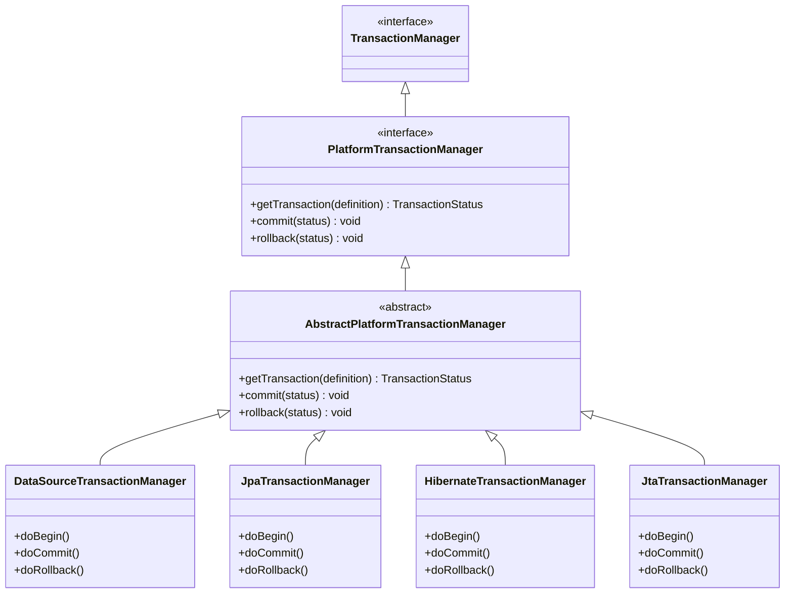
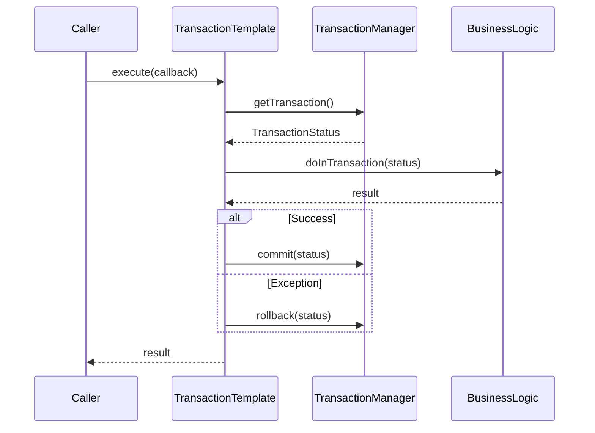
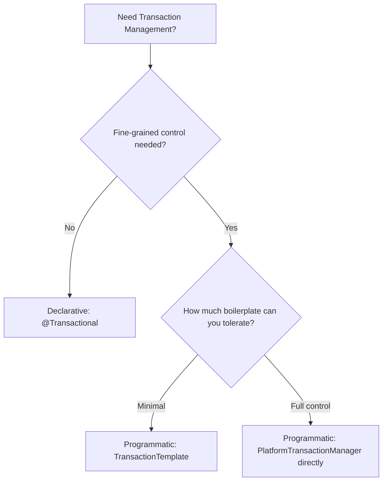
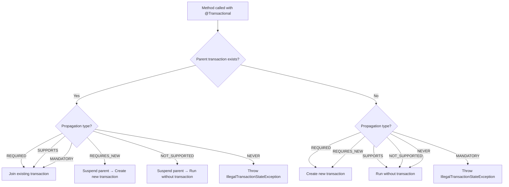
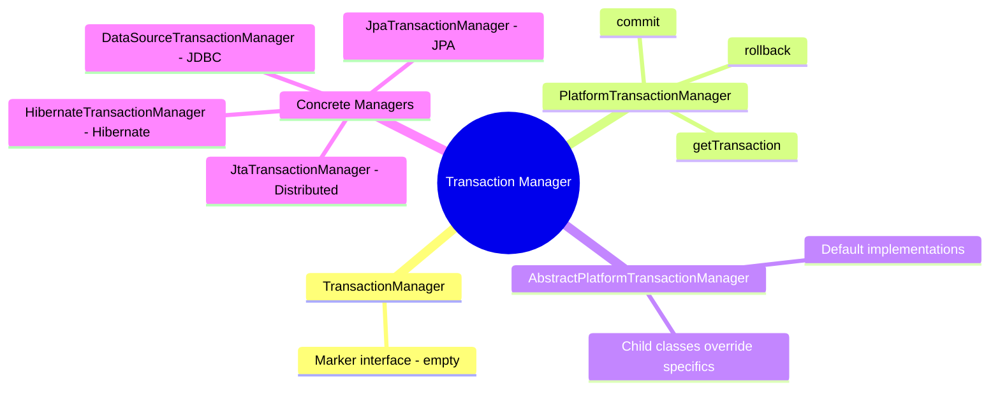

# 📌 Spring Boot Transaction Management — Part 2
### Transaction Manager Hierarchy · Declarative vs Programmatic · Transaction Propagation

---

> [!NOTE]
> This is **Part 2** of a series on Transaction Management in Spring Boot.
> Part 1 covered the `@Transactional` annotation, how the framework invokes an interceptor, and what that interceptor does internally.
> This guide assumes familiarity with `@Transactional`, AOP proxies, and basic Spring Bean configuration.

---

## Table of Contents

1. [Transaction Manager Hierarchy](#1-transaction-manager-hierarchy)
2. [Types of Transaction Management](#2-types-of-transaction-management)
3. [Declarative Transaction Management](#3-declarative-transaction-management)
4. [Programmatic Transaction Management](#4-programmatic-transaction-management)
5. [Transaction Propagation](#5-transaction-propagation)
6. [Passing Propagation — Declarative vs Programmatic](#6-passing-propagation--declarative-vs-programmatic)
7. [Summary & Quick Reference](#7-summary--quick-reference)
8. [Interview Notes](#8-interview-notes)
9. [Practice Questions](#9-practice-questions)

---

## 1. Transaction Manager Hierarchy

### Overview

Spring Boot abstracts transaction management through a clean interface hierarchy. Regardless of whether you use JDBC, JPA, Hibernate, or a NoSQL driver, all transaction managers follow the same contract defined at the top of this hierarchy.

Understanding this hierarchy is critical because:
- It explains **how `@Transactional` works under the hood**.
- It lets you **switch or explicitly configure** the right transaction manager.
- It is a **common interview topic**.

---

### The Four Layers

```
Layer 1 ──► TransactionManager                  (Interface — empty marker)
               │
Layer 2 ──► PlatformTransactionManager          (Interface — 3 key methods)
               │
Layer 3 ──► AbstractPlatformTransactionManager  (Abstract Class — default implementation)
               │
Layer 4 ──► Concrete Implementations
               ├── DataSourceTransactionManager  (JDBC)
               ├── JpaTransactionManager         (JPA)
               ├── HibernateTransactionManager   (Hibernate)
               └── JtaTransactionManager         (Distributed Transactions)
```

---

### Layer 1 — `TransactionManager` (Marker Interface)

```java
public interface TransactionManager {
    // Empty — marker interface only
}
```

- This is the **topmost interface** in the hierarchy.
- It is a **marker interface** — it contains no methods.
- Its purpose is purely to mark a class as a "transaction manager" so Spring's context can identify and wire it correctly.

---

### Layer 2 — `PlatformTransactionManager` (Core Interface)

```java
public interface PlatformTransactionManager extends TransactionManager {

    TransactionStatus getTransaction(TransactionDefinition definition)
        throws TransactionException;

    void commit(TransactionStatus status) throws TransactionException;

    void rollback(TransactionStatus status) throws TransactionException;
}
```

This interface defines the **three fundamental operations** of any transaction:

| Method | Purpose |
|--------|---------|
| `getTransaction()` | Begin or retrieve an existing transaction |
| `commit()` | Persist all changes made within the transaction |
| `rollback()` | Undo all changes made within the transaction |

> [!IMPORTANT]
> The `TransactionInterceptor` (the AOP interceptor triggered by `@Transactional`) uses **exactly these three methods** internally:
> - It calls `getTransaction()` to start the transaction.
> - On success, it calls `commit()`.
> - On exception (inside the `catch` block), it calls `rollback()`.

Because `PlatformTransactionManager` is an interface, something must **implement** it. That's where Layer 3 comes in.

---

### Layer 3 — `AbstractPlatformTransactionManager` (Abstract Class)

```java
public abstract class AbstractPlatformTransactionManager
    implements PlatformTransactionManager {

    // Provides DEFAULT implementations of getTransaction, commit, rollback
    // Concrete subclasses override only what's specific to their technology
}
```

- This abstract class provides a **default, reusable implementation** for `getTransaction`, `commit`, and `rollback`.
- The logic for most transaction managers (begin, commit, rollback) is **largely the same** regardless of the underlying technology.
- Concrete implementations (Layer 4) **extend** this class and override only the parts specific to their database driver or ORM.

---

### Layer 4 — Concrete Transaction Managers

These are the actual implementations that know how to talk to a specific database technology:

| Implementation | Used With | Notes |
|----------------|-----------|-------|
| `DataSourceTransactionManager` | Plain JDBC | You write raw SQL queries manually |
| `JpaTransactionManager` | JPA (Java Persistence API) | Entities mapped to tables; most CRUD auto-generated |
| `HibernateTransactionManager` | Hibernate | Hibernate-specific ORM framework |
| `JtaTransactionManager` | Distributed Transactions | Used with Two-Phase Commit across multiple DBs |

> [!TIP]
> **JPA vs JDBC:**
> - With **JDBC**, you write `INSERT INTO ...`, `SELECT * FROM ...` manually.
> - With **JPA**, you create entity classes annotated with `@Entity`, and Spring Data generates most queries for you. `JpaRepository` methods like `save()`, `findById()` require no SQL.
> - **Hibernate** is a popular JPA implementation — it *is* JPA-compliant but has its own additional features.

> [!NOTE]
> **What about NoSQL?**
> JDBC, JPA, and Hibernate all deal with **relational databases**. If you switch to a NoSQL database (MongoDB, Cassandra, etc.), you need to change the library entirely. The new library will bring its own transaction manager implementation. **The underlying concept — the same hierarchy — remains identical.**

---

### Hierarchy Diagram



---

## 2. Types of Transaction Management

Spring Boot provides **two approaches** to transaction management:

| | Declarative | Programmatic |
|---|---|---|
| **How** | Annotations (`@Transactional`) | Manual code (API calls) |
| **Spring hides boilerplate?** | ✅ Yes | ❌ No |
| **Flexibility** | Lower | Higher |
| **Maintainability** | High | Lower (repetitive code) |
| **Use case** | Most standard cases | Fine-grained control needed |

---

## 3. Declarative Transaction Management

### Overview

Declarative transaction management means you **declare** your transactional intent using an annotation — `@Transactional` — and Spring Boot handles all the wiring behind the scenes.

```java
@Transactional
public void updateUser(User user) {
    // business logic
}
```

When Spring Boot sees `@Transactional`, it:
1. Creates an **AOP proxy** around the method.
2. The `TransactionInterceptor` intercepts the call.
3. Internally calls `getTransaction()`, runs your method, then `commit()` or `rollback()`.

> [!NOTE]
> **Auto-selection of Transaction Manager:**
> When you use `@Transactional` without any configuration, Spring Boot **automatically** selects the appropriate transaction manager based on what's on the classpath. In most Spring Boot + JPA projects, it will choose `JpaTransactionManager`.

---

### Explicitly Specifying a Transaction Manager

Sometimes you need to override the auto-selected manager — for example, if you want to use raw JDBC instead of JPA.

**Step 1: Create a configuration class and declare a bean.**

```java
@Configuration
public class AppConfig {

    @Bean
    public PlatformTransactionManager userTransactionManager(DataSource dataSource) {
        // Explicitly using DataSourceTransactionManager (JDBC-based)
        return new DataSourceTransactionManager(dataSource);
    }
}
```

**Step 2: Reference the bean name in `@Transactional`.**

```java
@Transactional(transactionManager = "userTransactionManager")
public void updateUser(User user) {
    // Spring will find the bean named "userTransactionManager"
    // and use DataSourceTransactionManager for this method
}
```

> [!TIP]
> By default, the **method name** of the `@Bean` method is used as the bean name. So `userTransactionManager()` creates a bean named `"userTransactionManager"`.
> If you want a different name, use: `@Bean(name = "customName")`.

---

## 4. Programmatic Transaction Management

### Overview

Programmatic transaction management means you **write the transaction logic yourself** in code — calling `getTransaction()`, `commit()`, and `rollback()` explicitly.

**When to use programmatic over declarative?**

Consider this method:

```java
public void updateUser(User user) {
    updateDB_initialOperations(user);    // Step 1: DB operations
    callExternalAPI(user);              // Step 2: External API call (slow!)
    updateDB_finalOperations(user);     // Step 3: DB operations
}
```

If you put `@Transactional` on `updateUser()`:
- The **database connection is held open** for the entire duration.
- The external API call (Step 2) might take 3–4 seconds.
- During peak traffic, **holding DB connections** while waiting for an external API becomes a serious **bottleneck** — it can choke your system.

Programmatic approach lets you **wrap only the DB operations** in transactions and exclude the external API call from the transaction scope.

---

### Approach 1 — Manual API (`PlatformTransactionManager` directly)

```java
@Service
public class UserService {

    private final PlatformTransactionManager transactionManager;

    // Constructor injection
    public UserService(PlatformTransactionManager transactionManager) {
        this.transactionManager = transactionManager;
    }

    public void updateUserProgrammatic(User user) {
        // Step 1: Begin the transaction
        TransactionStatus status = transactionManager.getTransaction(null);

        try {
            // Step 2: Execute your business logic
            updateDB_initialOperations(user);
            // external API call can go here — OUTSIDE the transaction
            updateDB_finalOperations(user);

            // Step 3: Commit on success
            transactionManager.commit(status);

        } catch (Exception e) {
            // Step 4: Rollback on failure
            transactionManager.rollback(status);
            throw e;
        }
    }
}
```

**Supporting `AppConfig`:**

```java
@Configuration
public class AppConfig {

    @Bean
    public PlatformTransactionManager userTransactionManager(DataSource dataSource) {
        return new DataSourceTransactionManager(dataSource);
    }
}
```

#### Line-by-Line Explanation

| Line | Explanation |
|------|-------------|
| `transactionManager.getTransaction(null)` | Starts a new transaction. `null` means use default `TransactionDefinition` settings. Returns a `TransactionStatus` token. |
| `updateDB_initialOperations(user)` | Your actual DB write operations run inside the active transaction. |
| `transactionManager.commit(status)` | If no exception, all changes are permanently saved. |
| `transactionManager.rollback(status)` | On any exception, all changes are undone. |

> [!CAUTION]
> Approach 1 is verbose. If you need transactions in 100 methods, you'd write this boilerplate 100 times. That's where Approach 2 helps.

---

### Approach 2 — `TransactionTemplate` (Cleaner, Recommended)

`TransactionTemplate` is a **wrapper/template** provided by Spring that internally handles `getTransaction()`, `commit()`, and `rollback()`. You only provide your business logic as a callback.

**`AppConfig` — create a `TransactionTemplate` bean:**

```java
@Configuration
public class AppConfig {

    @Bean
    public PlatformTransactionManager userTransactionManager(DataSource dataSource) {
        return new DataSourceTransactionManager(dataSource);
    }

    @Bean
    public TransactionTemplate transactionTemplate(
            PlatformTransactionManager userTransactionManager) {
        return new TransactionTemplate(userTransactionManager);
        // You can also set propagation, name, etc. here (see Section 6)
    }
}
```

**Service class — use the template:**

```java
@Service
public class UserService {

    private final TransactionTemplate transactionTemplate;

    public UserService(TransactionTemplate transactionTemplate) {
        this.transactionTemplate = transactionTemplate;
    }

    public void updateUserProgrammatic(User user) {

        // Pass your business logic as a lambda (TransactionCallback)
        transactionTemplate.execute(status -> {
            updateDB_initialOperations(user);
            updateDB_finalOperations(user);
            return null; // Return null if no result needed
        });
    }
}
```

#### How `TransactionTemplate.execute()` works internally



#### Key Points about `TransactionTemplate`

- `execute()` accepts a `TransactionCallback` — a **functional interface** with the method `doInTransaction()`.
- Because it's a functional interface, you can pass a **lambda expression** as the callback.
- The template handles `getTransaction`, runs your callback, then handles `commit` or `rollback`.
- This is a **cleaner** approach compared to Approach 1 — less repetition, same power.

---

### Comparison: Declarative vs Approach 1 vs Approach 2



---

## 5. Transaction Propagation

### Overview

**Propagation** defines what happens when a `@Transactional` method is called **from within another `@Transactional` method**.

When the `TransactionInterceptor` calls `getTransaction()`, it first **checks the propagation setting** to decide:
- Should it join the existing transaction?
- Should it create a new one?
- Should it suspend the current one?
- Should it throw an exception?

---

### The Core Scenario

```
Method One  ──► @Transactional   →  Transaction T1 created
    │
    └──► calls
              │
          Method Two ──► @Transactional   →  What happens here?
```

When **Method One** starts, Transaction T1 is created. When **Method One** calls **Method Two** (which is also `@Transactional`), the interceptor fires again for Method Two. The **propagation value** determines whether Method Two:
- Joins T1
- Creates a new T2 (suspending T1)
- Runs without any transaction
- Throws an exception

> [!IMPORTANT]
> This is a **very common interview question**: *"What happens when a `@Transactional` method is called from another `@Transactional` method?"*
> The answer is: **It depends on the propagation setting.**

---

### All Propagation Types

#### `REQUIRED` (Default)

```java
@Transactional(propagation = Propagation.REQUIRED)
// Same as just: @Transactional
```

**Rule:**
- If a parent transaction **exists** → **join it** (use the same transaction).
- If no parent transaction **exists** → **create a new one**.

**Observed behavior:**
- Method One creates Transaction T1.
- Method Two (with `REQUIRED`) is called from Method One.
- Method Two **does NOT create a new transaction**. It runs inside T1.
- `TransactionSynchronizationManager.getCurrentTransactionName()` returns the **same name** (Method One's transaction name) when called inside Method Two.

```
Method One  [Transaction: T1]
    └──► Method Two  [Transaction: T1]  ← same transaction, no new one created
```

---

#### `REQUIRES_NEW`

```java
@Transactional(propagation = Propagation.REQUIRES_NEW)
```

**Rule:**
- If a parent transaction **exists** → **suspend** it, create a **new transaction** for Method Two.
- Once Method Two's transaction commits or rolls back → **resume** the parent transaction.
- If no parent transaction **exists** → create a new one.

> [!NOTE]
> **Suspend ≠ Abort.** Suspending a transaction means it is paused and waiting — it has NOT been committed or rolled back. It resumes after Method Two completes.

**Observed behavior:**
- Method One runs in T1.
- Method Two is called → T1 is suspended → T2 is created for Method Two.
- `getCurrentTransactionName()` inside Method Two shows a **different name** from Method One.
- After Method Two commits/rolls back → T1 resumes.

```
Method One  [Transaction: T1]
    └──► Method Two  [Transaction: T2]  ← new transaction, T1 suspended
         (T2 commits/rollbacks)
    └──► Method One resumes  [Transaction: T1]
```

---

#### `SUPPORTS`

```java
@Transactional(propagation = Propagation.SUPPORTS)
```

**Rule:**
- If a parent transaction **exists** → join it.
- If no parent transaction **exists** → execute **without any transaction**.

Use this for methods that can work with or without a transaction (e.g., read-only operations that don't strictly need transactional guarantees).

---

#### `NOT_SUPPORTED`

```java
@Transactional(propagation = Propagation.NOT_SUPPORTED)
```

**Rule:**
- If a parent transaction **exists** → **suspend** it, execute the method **without any transaction**, then resume the parent.
- If no parent transaction **exists** → execute **without any transaction**.

In other words: **always run without a transaction**, regardless of what the caller has.

---

#### `MANDATORY`

```java
@Transactional(propagation = Propagation.MANDATORY)
```

**Rule:**
- If a parent transaction **exists** → join it.
- If no parent transaction **exists** → **throw an exception**.

Use this when a method **must always** be called from within an active transaction. It never creates a new transaction on its own.

**Example use case:** An internal helper method that performs a critical DB operation and must always be part of a larger transaction.

---

#### `NEVER`

```java
@Transactional(propagation = Propagation.NEVER)
```

**Rule:**
- If a parent transaction **exists** → **throw an exception**.
- If no parent transaction **exists** → execute **without any transaction**.

Use this when a method **must never** run inside a transaction.

---

### Propagation Summary Table

| Propagation | Parent Transaction Exists | No Parent Transaction |
|-------------|--------------------------|----------------------|
| `REQUIRED` (default) | Join existing | Create new |
| `REQUIRES_NEW` | Suspend parent, create new | Create new |
| `SUPPORTS` | Join existing | Run without transaction |
| `NOT_SUPPORTED` | Suspend parent, run without transaction | Run without transaction |
| `MANDATORY` | Join existing | **Throw exception** |
| `NEVER` | **Throw exception** | Run without transaction |

---

### Propagation Flowchart



---

### How Spring Implements Propagation Internally

The propagation logic lives inside `AbstractPlatformTransactionManager`. When the `TransactionInterceptor` calls `createTransactionIfNecessary()`, which internally calls `getTransaction()`, the abstract class checks the propagation setting:

```java
// Simplified pseudocode inside AbstractPlatformTransactionManager

protected TransactionStatus handleExistingTransaction(
        TransactionDefinition definition, Object transaction) {

    if (definition.getPropagationBehavior() == PROPAGATION_NEVER) {
        throw new IllegalTransactionStateException("...");
    }

    if (definition.getPropagationBehavior() == PROPAGATION_NOT_SUPPORTED) {
        suspend(transaction);
        return prepareTransactionStatus(/* no transaction */);
    }

    if (definition.getPropagationBehavior() == PROPAGATION_REQUIRES_NEW) {
        SuspendedResourcesHolder suspendedResources = suspend(transaction);
        // start a new transaction
        return startTransaction(definition, transaction);
    }

    // REQUIRED, SUPPORTS, MANDATORY → join the existing transaction
    return prepareTransactionStatus(definition, transaction, false);
}
```

> [!TIP]
> You can verify this logic by looking at the Spring Framework source code in the `AbstractPlatformTransactionManager` class, specifically the `getTransaction()` method and the `handleExistingTransaction()` helper.

---

## 6. Passing Propagation — Declarative vs Programmatic

### Declarative

Simply include the `propagation` attribute in `@Transactional`:

```java
@Transactional(propagation = Propagation.REQUIRES_NEW)
public void myMethod() {
    // This always runs in a brand-new transaction
}

@Transactional(propagation = Propagation.MANDATORY)
public void criticalHelper() {
    // Must be called from within an active transaction
}
```

---

### Programmatic — Approach 1 (using `TransactionDefinition`)

Pass a `TransactionDefinition` object to `getTransaction()` instead of `null`:

```java
@Service
public class UserService {

    private final PlatformTransactionManager transactionManager;

    public UserService(PlatformTransactionManager transactionManager) {
        this.transactionManager = transactionManager;
    }

    public void updateUserProgrammatic(User user) {

        // Create a TransactionDefinition with custom settings
        DefaultTransactionDefinition definition = new DefaultTransactionDefinition();
        definition.setName("myCustomTransaction");
        definition.setPropagationBehavior(TransactionDefinition.PROPAGATION_REQUIRED);

        // Pass it to getTransaction()
        TransactionStatus status = transactionManager.getTransaction(definition);

        try {
            // Business logic
            updateDB(user);

            transactionManager.commit(status);
        } catch (Exception e) {
            transactionManager.rollback(status);
            throw e;
        }
    }
}
```

> [!NOTE]
> When `null` is passed to `getTransaction(null)`, Spring uses default settings.
> When a `TransactionDefinition` is passed, you control:
> - **Transaction name** (useful for monitoring/logging)
> - **Propagation behavior**
> - **Isolation level** (covered in Part 3)
> - **Timeout**
> - **Read-only flag**

---

### Programmatic — Approach 2 (using `TransactionTemplate`)

Set propagation and name directly on the `TransactionTemplate` bean in `AppConfig`:

```java
@Configuration
public class AppConfig {

    @Bean
    public PlatformTransactionManager userTransactionManager(DataSource dataSource) {
        return new DataSourceTransactionManager(dataSource);
    }

    @Bean
    public TransactionTemplate transactionTemplate(
            PlatformTransactionManager userTransactionManager) {

        TransactionTemplate template = new TransactionTemplate(userTransactionManager);

        // Configure propagation and name here
        template.setPropagationBehavior(TransactionDefinition.PROPAGATION_REQUIRES_NEW);
        template.setName("myTemplateTransaction");

        return template;
    }
}
```

Then use it in your service exactly as shown in Approach 2 earlier:

```java
transactionTemplate.execute(status -> {
    updateDB(user);
    return null;
});
```

---

## 7. Summary & Quick Reference

### Transaction Manager Hierarchy



### Key Bullets

- `TransactionManager` → empty marker interface (top of hierarchy).
- `PlatformTransactionManager` → defines `getTransaction`, `commit`, `rollback`.
- `AbstractPlatformTransactionManager` → provides default implementations; concrete classes extend and override.
- Concrete managers: `DataSourceTransactionManager`, `JpaTransactionManager`, `HibernateTransactionManager`, `JtaTransactionManager`.
- **Declarative** = `@Transactional` annotation; Spring hides boilerplate; auto-selects transaction manager.
- **Programmatic Approach 1** = Inject `PlatformTransactionManager`, manually call `getTransaction`, `commit`, `rollback`.
- **Programmatic Approach 2** = Inject `TransactionTemplate`, pass business logic as a lambda to `execute()`.
- **Propagation** = rules for what happens when one `@Transactional` method calls another.
- `REQUIRED` = default; joins existing or creates new.
- `REQUIRES_NEW` = always creates new; suspends existing.
- `SUPPORTS` = joins existing or runs without.
- `NOT_SUPPORTED` = always runs without transaction; suspends existing.
- `MANDATORY` = must have existing; throws if none.
- `NEVER` = must NOT have existing; throws if one exists.

---

## 8. Interview Notes

> [!IMPORTANT]
> The following are commonly asked in Spring Boot interviews.

**Q1: What is the hierarchy of Spring's transaction managers?**
- `TransactionManager` (marker interface) → `PlatformTransactionManager` (3 methods) → `AbstractPlatformTransactionManager` (default impl) → Concrete classes (`JpaTransactionManager`, etc.)

**Q2: What are the three core methods in `PlatformTransactionManager`?**
- `getTransaction()`, `commit()`, `rollback()`

**Q3: What is the default propagation type in `@Transactional`?**
- `PROPAGATION_REQUIRED`

**Q4: What happens when a `@Transactional` method calls another `@Transactional` method?**
- Depends on propagation. Default (`REQUIRED`) joins the existing transaction. `REQUIRES_NEW` suspends the parent and creates a new one.

**Q5: What is the difference between `REQUIRES_NEW` suspend and abort?**
- **Suspend** = parent transaction is paused but alive; it resumes after the inner transaction finishes.
- **Abort/Rollback** = transaction is permanently undone.

**Q6: When would you choose programmatic over declarative?**
- When you need fine-grained control — e.g., excluding a slow external API call from the transaction scope to avoid holding DB connections too long.

**Q7: What is `TransactionTemplate` and why is it better than direct `PlatformTransactionManager` usage?**
- `TransactionTemplate` wraps `getTransaction`, `commit`, and `rollback` into a reusable template. You only provide the business logic as a callback (lambda). It reduces boilerplate and improves readability.

**Q8: How does Spring Boot auto-select a transaction manager?**
- Based on classpath detection. If Spring Data JPA is present, `JpaTransactionManager` is used by default. You can override by declaring a `@Bean` of `PlatformTransactionManager`.

**Q9: What is `MANDATORY` propagation used for?**
- It enforces that a method must always be called from within an already-active transaction. It never creates a new transaction; instead throws `IllegalTransactionStateException` if no transaction exists.

**Q10: What is `JtaTransactionManager` used for?**
- For **distributed transactions** (spanning multiple databases or resource managers), often using the Two-Phase Commit protocol.

---

## 9. Practice Questions

### Easy

1. What are the three methods defined by `PlatformTransactionManager`?
2. What propagation type does `@Transactional` use by default?
3. What is the difference between declarative and programmatic transaction management?
4. In `TransactionTemplate`, what method do you call to execute your business logic?
5. If you want Spring Boot to use `DataSourceTransactionManager` instead of `JpaTransactionManager`, how do you configure it?

### Medium

6. Explain what happens, step-by-step, when Method A (`@Transactional`) calls Method B (`@Transactional(propagation = REQUIRES_NEW)`).
7. Why is holding a DB connection during an external API call a problem? How does programmatic transaction management solve it?
8. What is the difference between `SUPPORTS` and `NOT_SUPPORTED` propagation?
9. How do you pass a custom transaction name and propagation in Approach 1 (direct `PlatformTransactionManager` usage)?
10. What is `AbstractPlatformTransactionManager`'s role in the hierarchy?

### Hard

11. Trace the execution flow from an HTTP request hitting a `@Transactional` service method all the way to a database commit — mention all Spring components involved (`TransactionInterceptor`, `PlatformTransactionManager`, `AbstractPlatformTransactionManager`, concrete manager).
12. If you have 3 nested `@Transactional` methods — outer uses `REQUIRED`, middle uses `REQUIRES_NEW`, inner uses `MANDATORY` — describe the transactions that exist at each stage.
13. What would happen if `MANDATORY` is used on a method called directly from a non-`@Transactional` controller endpoint? What exception is thrown?
14. Design a service method that uses programmatic transaction management (Approach 2) to: wrap only the DB operations in a transaction, while the external API call happens outside the transaction. Show the full code with `AppConfig` and the service method.
15. What is the risk of using `REQUIRES_NEW` inside a high-volume service? How might it affect connection pool exhaustion?

---

> [!NOTE]
> **Part 3** of this series will cover **Isolation Levels** in depth — including `READ_UNCOMMITTED`, `READ_COMMITTED`, `REPEATABLE_READ`, and `SERIALIZABLE`, and how they control concurrent transaction behavior.
