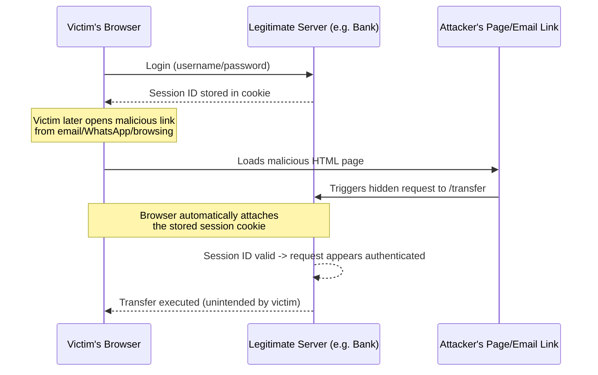
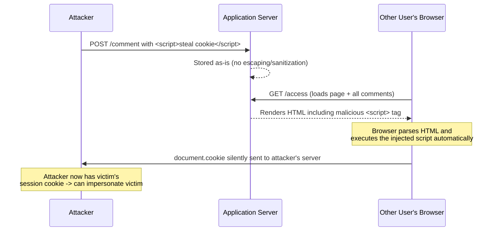

# Common Web Security Attacks: A Foundation Before Spring Security

> A complete study guide covering CSRF, XSS, CORS, and SQL Injection — the common attacks you must understand before learning Spring Security.

---

## Table of Contents

1. [Why Learn These Attacks Before Spring Security](#-why-learn-these-attacks-before-spring-security)
2. [CSRF — Cross-Site Request Forgery](#-csrf--cross-site-request-forgery)
3. [XSS — Cross-Site Scripting](#-xss--cross-site-scripting)
4. [CORS — Cross-Origin Resource Sharing](#-cors--cross-origin-resource-sharing)
5. [SQL Injection](#-sql-injection)
6. [Final Comparison Tables](#-final-comparison-tables)
7. [Practice Questions](#-practice-questions-overall)
8. [Overall Summary](#-overall-summary-revision-bullets)

---

# 📌 Why Learn These Attacks Before Spring Security

## Overview

Before diving into Spring Security's features, it is essential to first understand the common web attacks that Spring Security is actually designed to protect against. Without understanding *how* these attacks happen, it's difficult to appreciate *why* Spring Security's mechanisms (CSRF tokens, CORS configuration, input escaping, parameterized queries, etc.) exist and matter.

## Why This Concept Exists

Security frameworks and features are built as **countermeasures** to real, well-known attack patterns. Understanding the attacker's perspective first — how a malicious actor could exploit an unprotected endpoint or unescaped input — makes the corresponding defensive features (which will be studied in depth in later Spring Security sessions) much easier to understand and appreciate, rather than treating them as arbitrary configuration steps.

## Topics Covered in This Session

1. CSRF (Cross-Site Request Forgery)
2. XSS (Cross-Site Scripting)
3. CORS (Cross-Origin Resource Sharing) — a defensive feature rather than an attack itself
4. SQL Injection

> [!NOTE]
> This session focuses on **demonstrating** how these attacks occur, using simple Spring Boot demo endpoints. The actual Spring Security configuration and protective mechanisms will be covered in depth in subsequent sessions on Spring Security itself.

---

# 📌 CSRF — Cross-Site Request Forgery

## Overview

CSRF (Cross-Site Request Forgery) is an attack in which a malicious actor tricks a victim's browser into unknowingly sending an unwanted, authenticated request to a website where the victim is already logged in — without the victim's awareness or consent.

## Why This Concept Exists (Why This Attack Is Possible)

Browsers are designed to automatically attach stored cookies (including session identifiers) to every request sent to the domain that issued those cookies — regardless of what actually triggered that request (the user directly navigating, or a hidden/background request triggered by some other page). This convenient browser behavior, while necessary for normal session-based authentication to work smoothly, is exactly what CSRF attacks exploit: an attacker doesn't need to steal your session cookie at all — they simply need to trick your browser into sending a request to a site where you're already authenticated, and the browser will "helpfully" attach your valid session automatically.

## Definition

**CSRF** is an attack where the attacker tricks a user's browser into making an unwanted, unauthorized request to a website on which the user is already authenticated — with the browser automatically including the user's valid session credentials (e.g., session cookie) on that forged request, making the request appear entirely legitimate to the server.

> [!IMPORTANT]
> CSRF is **mostly applicable in scenarios where state/session is managed** — i.e., in **stateful**, session-based authentication systems (where a session ID is stored in a cookie and automatically resent by the browser on every request to that domain). It is far less of a concern in purely **stateless** authentication systems where credentials aren't automatically re-attached by the browser on every request.

## Real-World Analogy

Imagine you're a member of an exclusive club, and you're wearing a special wristband (your session cookie) that lets the door staff recognize you as an already-verified member. Someone tricks you into walking through a side door that automatically scans your wristband and orders something expensive on your account — you didn't intend to make that order, you were simply lured through a door that used your wristband without your knowledge. You never handed over your wristband; the attacker didn't need to steal it — they just exploited the fact that it's automatically scanned wherever you go.

## Internal Working

1. A user authenticates on a legitimate website (e.g., a bank site or Gmail). This is assumed to be **session-based authentication** — meaning after login, the server returns a session ID, which the browser stores in a cookie associated with that site's domain.
2. The attacker crafts a malicious link, or a hidden auto-submitting form/HTML page, that — when loaded or clicked — silently triggers a request to a **sensitive endpoint** on the legitimate site (for example, a money-transfer endpoint) — even though the request appears to originate from the attacker's own page.
3. The victim, while still logged into the legitimate site in the same browser, clicks the malicious link (received via email, WhatsApp, or encountered while browsing).
4. The victim's browser automatically attaches the session cookie for the legitimate site's domain to this forged request — **because that's simply how browsers work**, regardless of which page initiated the request.
5. The legitimate server receives the request, sees a valid, already-authenticated session ID attached, and — having no way to distinguish this from a request the user intentionally made — processes the request as if it were legitimate (e.g., executing the money transfer).
6. The victim is completely unaware that anything happened beyond clicking what looked like an innocuous link.

## Step-by-Step Execution (Demo Walkthrough)

The lecture demonstrates this with a simple Spring Boot server exposing a `/transfer` endpoint, protected only by a blanket rule that "any request must be authenticated" (with no CSRF-specific protection).

**Step 1 — User authenticates on the server:**
1. The user logs in (provides username and password) to a locally running server (standing in for any real site like a bank, Gmail, or Facebook).
2. Upon successful login, the server returns a response that includes a session ID, which gets stored by the browser in its cookies for that domain.
3. The server maintains and recognizes this same session ID on subsequent requests from that browser.

**Step 2 — The victim encounters a malicious link:**
1. A basic HTML page is crafted (representing what an attacker might send via email or host on a lookalike site).
2. This HTML page contains a link/button that, when clicked, internally triggers a call to the same server's `/transfer` endpoint (the sensitive money-transfer API) — but this HTML page **does not itself attach any cookie or session** manually; it doesn't need to.
3. When the victim clicks this link, the browser automatically attaches the previously stored session cookie to the outgoing request to the legitimate server's domain — because that's the browser's normal, automatic behavior for any request to a domain for which it holds cookies.
4. Inspecting the outgoing request confirms that the same session ID from Step 1 is present on this "unwanted" request, even though the request was actually initiated from the attacker's HTML page.
5. Since the session ID is valid and already authenticated, the server processes the transfer request as if it were a legitimate, user-intended action.

## Diagram — CSRF Attack Flow



## Key Observations

- The attacker **never needs to see or steal** the victim's session cookie — they only need to trick the browser into sending a request to a domain where a valid session already exists.
- This is fundamentally a browser-behavior exploitation: browsers automatically attach cookies to requests destined for the cookie's issuing domain, regardless of what "initiated" the request.
- CSRF is primarily a concern for **session/cookie-based (stateful)** authentication schemes.

## Common Mistakes

> [!WARNING]
> Assuming that requiring authentication alone (i.e., "every request must be authenticated") is sufficient protection against CSRF. As demonstrated, an already-authenticated victim's browser will automatically satisfy that authentication requirement on the attacker's forged request too — authentication alone does not distinguish a request the user *intended* to make from one silently triggered on their behalf.

## Best Practices — Protecting Against CSRF

### Using a CSRF Token

- In addition to the session cookie, the server can issue a separate, unique **CSRF token** in its response.
- This token is known only to legitimate, authenticated pages/forms served directly by the actual site — an attacker's independently hosted malicious page has no way of knowing or obtaining this token.
- Legitimate forms/requests from the actual website will include this CSRF token as part of the request (in addition to the automatically-attached session cookie).
- The server validates that the CSRF token is present and correct **in addition to** validating the session — if an attacker's forged request lacks the correct CSRF token (which it will, since the attacker has no way to know it), the server rejects the request, even though the session cookie itself may be valid.

> [!TIP]
> Think of the CSRF token as a second, page-specific "secret handshake" that only legitimate pages of the actual site know — the attacker's forged HTML page cannot produce it, since it never received it from the real server.

## Interview Notes

- **Q: What makes CSRF possible in the first place?** The browser's automatic behavior of attaching stored cookies (including session IDs) to any request sent to the cookie's originating domain, regardless of what triggered the request.
- **Q: Is CSRF equally a concern in stateless authentication systems?** No — it's mostly a concern in **stateful/session-based** systems where a session cookie is automatically resent by the browser; it is much less of a concern where credentials aren't automatically reattached to every request by the browser itself.
- **Q: How does a CSRF token help defend against this attack?** Because it is a secret known only to legitimate pages served by the real site, an attacker's independently-hosted malicious page cannot know or supply the correct token, so the forged request can be rejected even though the session cookie is valid.

## Related Concepts

- [CORS](#-cors--cross-origin-resource-sharing) (can act as a first line of defense that might prevent an attacker's origin from even being entertained)
- Stateless vs. stateful authentication

## Practice Questions

**Easy:** What does CSRF stand for, and in one sentence, what does it do?

**Medium:** Why does simply requiring "the request must be authenticated" fail to prevent a CSRF attack?

**Hard:** Explain, step by step, how a CSRF token defends against a forged request even when the attacker's forged request still carries the victim's valid session cookie.

## Summary

- CSRF tricks an already-authenticated victim's browser into sending unwanted requests to a site where they're logged in.
- The browser automatically attaches the valid session cookie to the forged request — the attacker never needs to see or steal that cookie.
- Mostly relevant to stateful/session-based authentication.
- Defense: use a CSRF token (a secret known only to legitimate pages of the real site) in addition to session-based authentication.

---

# 📌 XSS — Cross-Site Scripting

## Overview

XSS (Cross-Site Scripting) is an attack where a malicious actor injects a script into a web page's content (such as a comment or post) such that the script executes in the browser of **other users** who later view that page — potentially stealing their session/cookie or otherwise compromising their browser session.

## Why This Concept Exists (Why This Attack Is Possible)

Many web applications accept free-form user input (comments, posts, reviews) and later render that input back to other users as part of the page's HTML. If the application renders this user-supplied content **without properly escaping special characters**, the browser cannot distinguish between "text the user wrote" and "actual HTML/JavaScript to execute." If the input happens to contain a `<script>` tag, the browser will simply execute it as real code, exactly as if the site's own developers had written it.

## Definition

**XSS** allows an attacker to insert a malicious script into a web page that is later viewed by other users — the script executes with the same trust and privileges as the legitimate page itself, commonly used for stealing session cookies or defacing the website.

## Real-World Analogy

Imagine a public bulletin board where anyone can pin up a note. If the board's rule is "read every note aloud exactly as written, including any instructions written on it," then someone could pin a note saying "Everyone who reads this: go tell the front desk to hand over all your keys." If the board blindly follows the instruction, everyone who reads it exposes themselves — this is exactly what an unescaped script embedded in rendered HTML does to a victim's browser.

## Internal Working

1. The application exposes a page (e.g., a comments page) where any user can **post** free-form text, which gets stored (in a database or in-memory) and later **rendered directly into the HTML** shown to every visitor.
2. If the application does not sanitize or escape the posted text, an attacker can post a comment that is actually a `<script>...</script>` block instead of ordinary text.
3. This malicious comment gets stored just like any normal comment.
4. When any other user (or even the attacker themselves) subsequently visits the page and the server renders the full list of comments (including the malicious one) back into the HTML response, the browser parses this HTML and encounters the `<script>` tag.
5. Because the browser has no way of knowing this script wasn't intended by the site itself, it simply **executes the script** as part of rendering the page.
6. Whatever that script does — showing a harmless alert popup, or something far more dangerous like reading `document.cookie` and silently sending it to an attacker-controlled server — happens automatically, in the victim's own authenticated browser session, with no further action needed from the victim beyond just viewing the page.

## Step-by-Step Execution (Demo Walkthrough)

The lecture demonstrates this using a simple Spring Boot application with two endpoints:

- **`GET /access`** — implemented using `@Controller` (not `@RestController`), because the goal is to **render an actual HTML page** (a view), rather than just return raw data (as `@RestController` would). This endpoint loads and displays all currently stored comments.
- **`POST /comment`** — accepts a new comment (as plain text/string) and stores it, appending it to an in-memory list. Because Spring-managed beans/controllers are singletons by default (only one instance of the controller/list is created for the whole application), every submitted comment keeps getting appended to the **same shared list**, regardless of how many times the endpoint is called.

**Execution steps:**

1. The user visits `/access`, which renders an HTML page containing a "Leave a comment" input field and a list of previously submitted comments.
2. As an attacker, instead of typing a normal comment, the user types something like `<script>alert('XSS attack')</script>` into the comment field and clicks Submit.
3. Clicking Submit triggers a call to the `POST /comment` endpoint, which stores this raw string — script tags and all — directly into the shared in-memory list, with no escaping or validation.
4. **Any** user (including the original attacker, or anyone else) who subsequently visits `/access` triggers a `GET` call that loads and renders **all** stored comments, including the malicious script comment, directly into the HTML.
5. As soon as the browser parses this HTML and encounters the injected `<script>` tag, it executes it immediately — resulting in, in the simple demo case, a popup alert box appearing.

### Escalating the Attack — From a Harmless Popup to Cookie Theft

A simple `alert(...)` popup might seem harmless, but the **same underlying mechanism** can be trivially escalated:

- Instead of `alert('XSS attack')`, the attacker could instead inject a script that redirects `document.cookie` (the victim's actual browser cookie, which includes their session ID) to an attacker-controlled URL.
- Since this script runs inside the **victim's own browser**, in the context of the legitimate site, it has full access to that browser's cookies for that site.
- Once the attacker receives the victim's cookie (and therefore their session ID), the attacker can impersonate the victim on any resource where that session ID is valid — a complete security compromise, not just a nuisance popup.

## Diagram — XSS Attack Flow



## Key Observations

- The malicious script executes in the **victim's own browser**, not the attacker's — this is what makes XSS so dangerous: it borrows the trust and session privileges of whoever views the page.
- A trivial `alert()` popup and a full session-hijacking cookie-theft script use exactly the same underlying vulnerability — only the payload differs.
- Because Spring beans/controllers are singletons by default, a shared in-memory list (as used in the demo) accumulates comments across all requests/users, meaning a single malicious comment can be viewed — and executed — by every subsequent visitor to the page.

## Common Mistakes

> [!WARNING]
> Rendering user-submitted content directly into HTML without escaping special characters (like `<`, `>`, `"`, `'`) is the root cause of XSS. Beginners often assume that simply "displaying whatever the user typed" is harmless, without realizing the browser cannot distinguish user-authored text from executable script tags unless those special characters are properly escaped.

## Best Practices — Protecting Against XSS

1. **Properly escape user input** before rendering it back into HTML. Special characters (like `<` and `>`) must be converted into their safe HTML-entity equivalents (e.g., `<` becomes `&lt;`) so that the browser treats the content as plain **text to display**, not as markup/script **to execute**.
2. **Perform proper validation** on what values are allowed as input in the first place — restricting or rejecting input patterns that resemble script tags or other executable content where such content is never legitimately expected.

> [!TIP]
> Once user input is properly escaped, a submitted `<script>alert('XSS')</script>` will be displayed literally as that text string on the page (harmless), rather than being interpreted and executed by the browser as real JavaScript.

## Interview Notes

- **Q: What is the fundamental root cause of XSS?** Rendering unescaped, attacker-controlled input directly into a page's HTML, causing browsers to execute it as if it were legitimate code from the site itself.
- **Q: Why is XSS more dangerous than it might initially appear (e.g., beyond just a popup)?** Because the exact same mechanism that shows a harmless `alert()` can just as easily exfiltrate `document.cookie` (and therefore the victim's session), enabling full account/session takeover.
- **Q: What are the two main defenses against XSS mentioned?** Properly escaping special characters in user input before rendering, and validating what input values are permitted in the first place.

## Related Concepts

- [CSRF](#-csrf--cross-site-request-forgery) (both exploit trust in an authenticated browser session, though via different mechanisms)
- Singleton-scoped Spring beans (relevant to why the demo's in-memory comment list is shared across all requests)

## Practice Questions

**Easy:** What does XSS stand for, and what does it fundamentally allow an attacker to do?

**Medium:** Why does an unescaped `<script>` tag submitted as a "comment" end up executing in another user's browser rather than just being displayed as text?

**Hard:** Explain how a simple `alert()`-based XSS proof-of-concept could be escalated into a full session-hijacking attack, and describe the two primary defensive measures that would prevent this escalation.

## Summary

- XSS lets an attacker inject a script into content later rendered to other users, who then unknowingly execute it in their own browser.
- The same vulnerability can produce anything from a harmless popup to full cookie/session theft, depending only on the injected payload.
- Defense: properly escape special characters in user input before rendering it as HTML, and validate allowed input values.

---

# 📌 CORS — Cross-Origin Resource Sharing

## Overview

CORS (Cross-Origin Resource Sharing) is **not itself an attack** — rather, it is a **security feature** (which can be enabled or configured) that restricts web pages from making requests to a different origin than the one that served them, unless the target server explicitly allows it.

## Why This Concept Exists

Browsers, by default, prevent a page loaded from one origin from freely making requests to a different origin and reading the response, in order to prevent malicious pages from silently interacting with other sites on a victim's behalf (which ties directly into how CSRF-style attacks could otherwise be facilitated). CORS gives servers explicit control over **which origins are allowed** to make cross-origin requests to them, so that only trusted, whitelisted origins are entertained, and requests from unknown or attacker-controlled origins are rejected outright by the browser before they even reach meaningful processing.

## Definition

**CORS** is a browser-enforced security feature that restricts web pages from making requests to a different **origin** than their own, unless the target server explicitly permits that origin via response headers (e.g., `Access-Control-Allow-Origin`).

## What Counts as a Different "Origin"

An **origin** is defined by the combination of:

1. **Protocol** (e.g., `http` vs. `https`)
2. **Domain** (e.g., `example.com` vs. `sub.example.com`)
3. **Port** (e.g., `8080` vs. `9090`)

If **any one** of these three differs between the client (the page making the request) and the server (the page/API being called), the request is considered **cross-origin**, and CORS rules apply.

### Examples of Different Origins

| Client | Server | Same Origin? | Why |
|---|---|---|---|
| `https://localhost:8080` | `http://localhost:8080` | ❌ Different | Protocol differs (`https` vs `http`) |
| `http://localhost:8080` | `http://localhost:9090` | ❌ Different | Port differs |
| `http://sub.localhost` | `http://localhost` | ❌ Different | Domain differs (subdomain counted as a different domain) |
| `http://localhost:8080` | `http://localhost:8080` | ✅ Same | Protocol, domain, and port all match |

## Internal Working

1. When a web page (client) attempts to make a request to a server whose origin differs from the page's own origin, the browser checks whether the target server has explicitly permitted that requesting origin.
2. This permission is communicated via response headers — most notably `Access-Control-Allow-Origin` — which the server includes in its responses to indicate which origins are allowed to access its resources.
3. Servers can configure exactly which origins, HTTP methods (`GET`, `POST`, `PUT`, `DELETE`, etc.), and headers are permitted for cross-origin requests.
4. If the requesting origin is **not** in this allowed list, the browser blocks the response from being accessible to the requesting page's JavaScript (even if the server technically processed the request), effectively preventing the attacker's page from being able to use the result.

## Syntax (Conceptual Spring Configuration)

```java
@Configuration
public class CorsConfig {

    @Bean
    public CorsConfigurationSource corsConfigurationSource() {
        CorsConfiguration configuration = new CorsConfiguration();
        configuration.setAllowedOrigins(List.of("https://localhost:9090"));
        configuration.setAllowedMethods(List.of("GET", "POST", "PUT", "DELETE"));
        configuration.setAllowedHeaders(List.of("*"));

        UrlBasedCorsConfigurationSource source = new UrlBasedCorsConfigurationSource();
        source.registerCorsConfiguration("/**", configuration);
        return source;
    }
}
```

## Syntax Breakdown

| Part | Meaning |
|---|---|
| `setAllowedOrigins(List.of("https://localhost:9090"))` | Explicitly whitelists only this one origin (protocol + domain + port combination) to make cross-origin requests to this server. Any other origin will be rejected. |
| `setAllowedMethods(List.of("GET","POST","PUT","DELETE"))` | Specifies which HTTP methods are permitted for cross-origin requests from allowed origins. |
| `setAllowedHeaders(List.of("*"))` | Specifies which request headers are permitted to be sent as part of a cross-origin request. |
| `registerCorsConfiguration("/**", configuration)` | Applies this CORS configuration to all endpoints (`/**` matches every path) in the application. |

## Key Observations

- CORS is a **security feature**, not itself an attack — it's a defensive control that a server (or the framework hosting it) can enable and configure.
- CORS can act as a **first line of defense**: if an attacker's page is running on an entirely different, non-whitelisted origin, the browser will refuse to let that page successfully interact with (or read responses from) the protected server at all — potentially stopping certain attack attempts (like some forms of CSRF) before they even get a chance to succeed, **in addition to** other defenses like CSRF tokens.
- Even a difference in just **one** of the three origin components (protocol, domain, or port) is enough for the browser to treat the request as cross-origin and apply CORS restrictions.

## Common Mistakes

> [!WARNING]
> Assuming that matching domain names alone is sufficient to be considered the "same origin." As shown in the examples above, differences in protocol (`http` vs `https`) or port number alone are enough to make two URLs count as **different origins**, even if the domain name is identical.

## Best Practices

- Explicitly whitelist only the specific, trusted origins that legitimately need to access your API — avoid overly permissive wildcard configurations for allowed origins in production.
- Treat CORS as one layer of defense among several (alongside CSRF tokens and proper authentication) — it complements, but does not replace, other protections like CSRF tokens.
- Be precise about allowed HTTP methods and headers, granting only what is actually needed by legitimate clients.

## Interview Notes

- **Q: Is CORS an attack?** No — it is a browser-enforced security **feature**/mechanism that restricts cross-origin requests unless explicitly permitted by the server.
- **Q: What exactly defines an "origin"?** The combination of protocol, domain, and port — if any one differs, it's considered a different origin.
- **Q: How does CORS relate to CSRF?** CORS can act as an additional, earlier line of defense — if an attacker's page is hosted on a non-whitelisted origin, the browser may block that page from successfully interacting with the protected server at all, complementing (but not replacing) CSRF-specific protections like CSRF tokens.

## Related Concepts

- [CSRF](#-csrf--cross-site-request-forgery) (CORS can serve as an additional first line of defense against certain cross-origin attack attempts)

## Practice Questions

**Easy:** What three components together define an "origin" for CORS purposes?

**Medium:** Is `http://localhost:8080` the same origin as `https://localhost:8080`? Explain why or why not.

**Hard:** Explain how CORS can function as a "first line of defense" in relation to CSRF-style attacks, and why it is still not considered a complete replacement for CSRF-specific protections like CSRF tokens.

## Summary

- CORS is a security **feature**, not an attack, that restricts cross-origin requests unless the server explicitly allows them.
- Origin = protocol + domain + port; any difference in any of the three makes it a different origin.
- Servers configure allowed origins, methods, and headers (e.g., via `Access-Control-Allow-Origin` and related settings).
- CORS can serve as a first line of defense alongside CSRF tokens, but does not replace them.

---

# 📌 SQL Injection

## Overview

SQL Injection is an attack in which a malicious actor manipulates a SQL query by inserting crafted, malicious input into a user-controllable field (such as a search box or form field), causing the database to execute unintended commands — potentially exposing, modifying, or deleting data the attacker was never authorized to access.

## Why This Concept Exists (Why This Attack Is Possible)

Applications often build SQL queries by directly concatenating raw, unvalidated user input into the query string. Because SQL syntax uses plain text for both the query structure and the values being searched for, if user input is inserted directly into the query without proper handling, an attacker can craft input that **changes the actual structure and logic of the query itself** — not just supply a value to search for.

## Definition

**SQL Injection** occurs when an attacker manipulates a SQL query's actual logic by inserting malicious input (often containing SQL syntax elements like quotes, logical operators, or comment markers) into a field that gets directly concatenated into a database query, without proper parameterization or validation.

## Internal Working

Consider a simple search feature, where the application takes user input directly and builds a query like this (conceptually):

```sql
SELECT * FROM products WHERE type = '<user_input>'
```

If the user types a normal value like `cold drinks`, the resulting query is harmless:

```sql
SELECT * FROM products WHERE type = 'cold drinks'
```

But if the application is directly concatenating the raw user input into the query string (rather than treating it as a safely-bound parameter), an attacker can supply input that is itself valid SQL syntax, altering the query's actual logic — for example, injecting a condition that is always true, bypassing the intended filter entirely, or even appending entirely separate destructive statements.

## Code Examples

### Beginner Example — The Vulnerable Pattern

```java
@GetMapping("/find")
public List<User> findUser(@RequestParam String name) {
    String query = "SELECT * FROM user_details WHERE username = '" + name + "'";
    return jdbcTemplate.query(query, ...);
}
```

**Explanation:** The `name` parameter, supplied directly by the caller of this endpoint, is concatenated **directly** into the SQL query string with no validation or parameterization. Whatever the caller passes as `name` becomes part of the actual SQL statement executed against the database.

### Intermediate Example — Exploiting the Vulnerability

Suppose the database currently contains two legitimate user records. A normal call like:

```
GET /find?name=alice
```

produces the query:

```sql
SELECT * FROM user_details WHERE username = 'alice'
```

which correctly returns only Alice's record (or nothing, if no such user exists).

Now suppose an attacker instead calls:

```
GET /find?name= OR 1=1 --
```

**Line-by-Line Explanation of the Exploit:**

- The application builds the query by directly substituting whatever was supplied as `name` into the query string, in place of the intended value.
- The final constructed query becomes conceptually:

```sql
SELECT * FROM user_details WHERE username = '' OR 1=1
```

- Breaking this down: `username = ''` (empty string, likely matching no legitimate row) is now combined with `OR 1=1` — and since `1=1` is **always true**, the entire `WHERE` clause evaluates to true for **every row** in the table, regardless of the actual `username` value.
- As a result, the query returns **all rows** in the `user_details` table — not just the one (if any) matching the intended username — completely bypassing the intended filtering logic.

### Output

```
Intended behavior: return only the row(s) matching the given username.
Actual behavior after injection: returns the ENTIRE user_details table — every row,
regardless of username — because the injected "OR 1=1" makes the WHERE clause always true.
```

## Key Observations

- SQL Injection doesn't just let an attacker view unauthorized data — depending on the database permissions and the injected payload, an attacker could also **retrieve database/table/column names**, **delete tables**, or **drop the entire database**.
- The root vulnerability is **directly concatenating unvalidated user input into a query string**, rather than treating user input strictly as a data value bound to a query parameter.
- This is fundamentally similar in spirit to XSS: in both cases, user-supplied input is trusted and directly merged into something that gets **interpreted/executed** (HTML+JavaScript in the case of XSS, SQL syntax in the case of SQL Injection) rather than being treated purely as inert data.

## Common Mistakes

> [!WARNING]
> Directly concatenating user input into a SQL query string — even for something that seems as simple as a "search by name" feature — is the root cause of SQL Injection. This remains dangerous even if the field seems "obviously" meant to hold only simple text values; nothing on the server side prevents an attacker from submitting SQL syntax through that same field unless the query itself is constructed safely.

## Best Practices — Protecting Against SQL Injection

### Use Parameterized Queries

Rather than directly concatenating the user-supplied value into the query string, use **parameterized queries** (bound parameters / placeholders), where the value is passed **separately** from the query structure and is never interpreted as part of the SQL syntax itself — it is always treated strictly as a literal value to match against, no matter what characters it contains.

```java
@GetMapping("/find")
public List<User> findUser(@RequestParam String name) {
    String query = "SELECT * FROM user_details WHERE username = :username";
    // 'name' is bound as a parameter value, never concatenated into the query string
    return entityManager.createQuery(query)
                         .setParameter("username", name)
                         .getResultList();
}
```

**Explanation:** With this approach, even if an attacker supplies input like `' OR 1=1 --`, that entire string is treated strictly as **the literal value being searched for** in the `username` column — not as SQL syntax to be executed. Since no username in the table literally equals the string `' OR 1=1 --`, the query correctly returns **no results**, safely neutralizing the injection attempt.

> [!TIP]
> The lecture notes that this is exactly the same parameterization concept already covered when discussing JPQL — using `setParameter(...)`-style binding rather than string concatenation ensures user input is always treated as a value, never as executable query logic.

## Interview Notes

- **Q: What is the root cause of SQL Injection?** Directly concatenating unvalidated, attacker-controllable input into a SQL query string, allowing the input to alter the query's actual logic rather than being treated purely as a data value.
- **Q: How do parameterized queries prevent SQL Injection?** They separate the query's structure from the supplied values — the value is always bound and treated strictly as literal data to match, regardless of what characters (including SQL syntax) it contains, so it can never alter the query's logic.
- **Q: Besides reading unauthorized data, what else can SQL Injection potentially allow?** Retrieving database/table/column metadata, and even deleting or dropping tables/databases, depending on the database permissions available to the vulnerable application's connection.

## Related Concepts

- [XSS](#-xss--cross-site-scripting) (conceptually similar root cause: untrusted input directly merged into something that gets interpreted/executed)
- JPQL and parameterized queries (referenced directly as the established protection mechanism)

## Practice Questions

**Easy:** What is SQL Injection, in one sentence?

**Medium:** Given the query `SELECT * FROM user_details WHERE username = '<input>'`, explain what happens if the input is ` OR 1=1 --` and why.

**Hard:** Explain, at a conceptual level, why parameterized queries prevent SQL Injection even when the supplied value contains characters that would otherwise be valid SQL syntax (like quotes or `OR` conditions).

## Summary

- SQL Injection manipulates a SQL query's logic by inserting malicious input into a field that gets directly concatenated into the query string.
- A classic payload like `' OR 1=1 --` can turn a filtered query into one that returns the entire table.
- Beyond unauthorized reads, it can potentially expose schema details or allow destructive operations (dropping tables/databases).
- Defense: use parameterized queries (bound parameters), ensuring user input is always treated strictly as a literal value, never as executable query syntax.

---

# 📌 Final Comparison Tables

## Attack vs. Feature Classification

| Name | Is It an Attack? | Primary Target | Root Cause | Primary Defense |
|---|---|---|---|---|
| CSRF | ✅ Attack | Server-side authenticated actions | Browser auto-attaching session cookies to any request, regardless of origin/intent | CSRF token (in addition to session) |
| XSS | ✅ Attack | Other users viewing a page | Rendering unescaped user input directly as executable HTML/JS | Escaping special characters + input validation |
| CORS | ❌ Not an attack — a defensive feature | Browser-enforced restriction on cross-origin requests | N/A (it's a protective mechanism) | Explicitly whitelisting trusted origins |
| SQL Injection | ✅ Attack | The application's database | Concatenating unvalidated user input directly into a SQL query string | Parameterized queries |

## Where Each Attack "Lives"

| Attack | Executes In | Exploits |
|---|---|---|
| CSRF | Victim's browser (forged request) | Browser's automatic cookie attachment |
| XSS | Victim's browser (rendered page) | Lack of input escaping when rendering user content |
| SQL Injection | The database server | Lack of query parameterization |

---

# 📌 Practice Questions (Overall)

**Easy**
1. Which of the four topics discussed (CSRF, XSS, CORS, SQL Injection) is *not* actually an attack?
2. What does a CSRF token protect against that a session cookie alone does not?
3. What is the most direct fix for SQL Injection?

**Medium**
4. Explain why CSRF is described as "mostly applicable where state and session is managed."
5. Why does a script injected via a comment field in an XSS attack execute in *other users'* browsers rather than the attacker's own?
6. What three components determine whether two URLs share the same "origin" under CORS rules?

**Hard**
7. Compare and contrast CSRF and XSS in terms of what exactly the attacker manipulates (a request vs. rendered content) and where the resulting malicious action actually executes.
8. Explain how CORS could act as a partial defense against certain CSRF-style attempts, and why it is still not a complete substitute for CSRF tokens.
9. Walk through exactly how the payload `' OR 1=1 --` changes the logic of a concatenated SQL query, and explain precisely why a parameterized query approach neutralizes this same payload.

---

# 📌 Overall Summary (Revision Bullets)

- **CSRF**: Tricks an already-authenticated victim's browser into sending an unwanted request to a site where they're logged in; the browser auto-attaches the valid session cookie. Mostly relevant to stateful/session-based auth. Defense: CSRF tokens.
- **XSS**: Injects a malicious script into content that gets rendered to other users, causing their browsers to execute it — can range from a harmless popup to full cookie/session theft. Defense: escape special characters in user input + validate allowed input.
- **CORS**: Not an attack — a browser-enforced security feature restricting cross-origin requests (origin = protocol + domain + port) unless the server explicitly whitelists the requesting origin. Can serve as a first line of defense alongside CSRF tokens.
- **SQL Injection**: Manipulates a SQL query's actual logic by inserting malicious input (e.g., `' OR 1=1 --`) into a field directly concatenated into the query, potentially exposing or destroying data. Defense: parameterized queries, which always treat user input as a literal value rather than executable query syntax.

> [!NOTE]
> The lecturer indicates that Spring Security itself — including the concrete configuration and mechanisms for protecting against each of these attacks — will be covered in depth in the following sessions.
