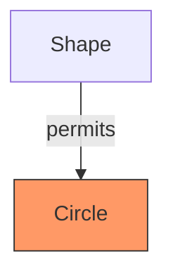
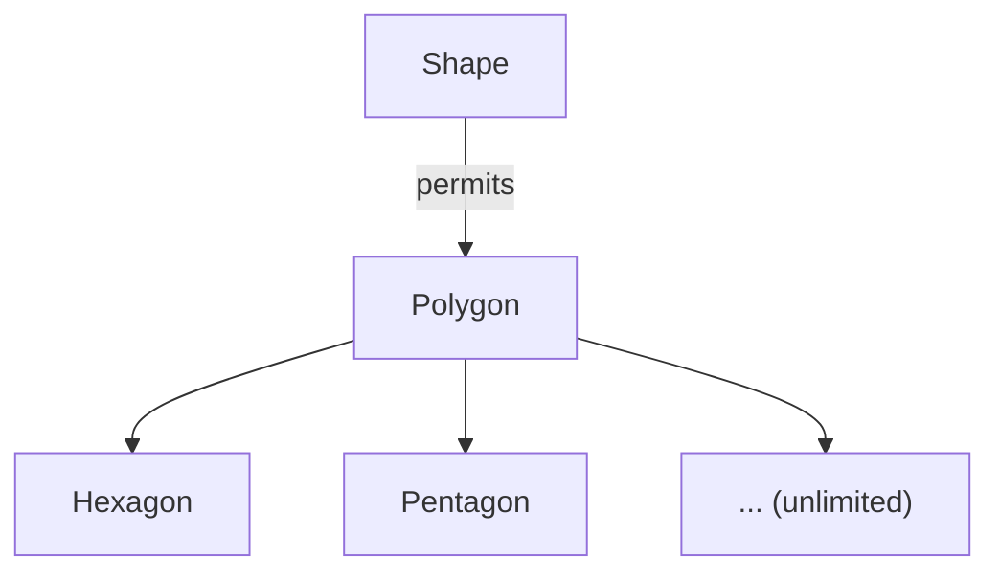
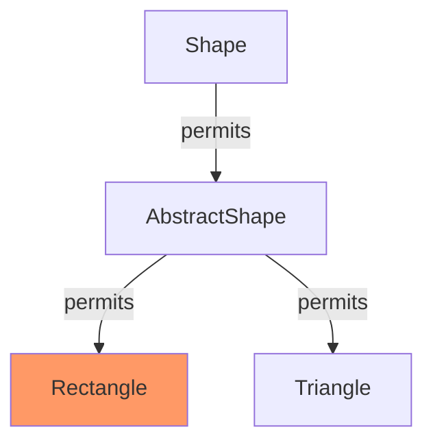
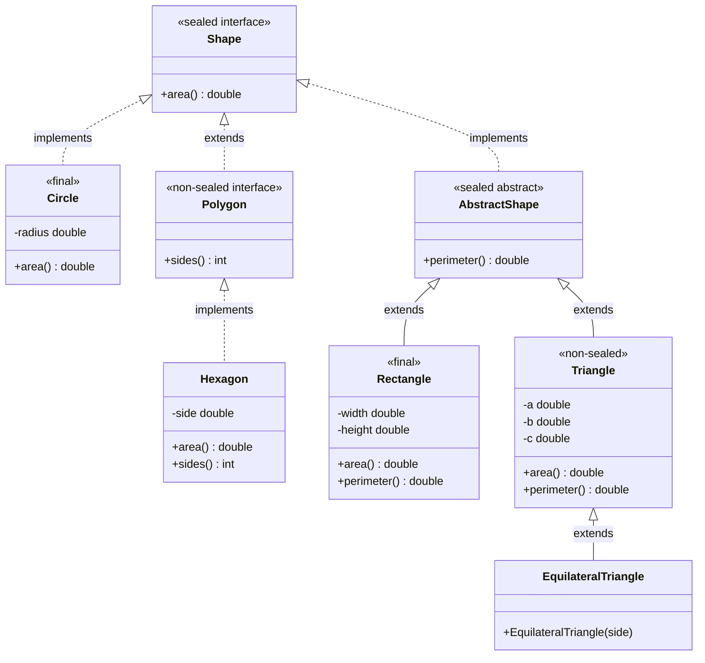
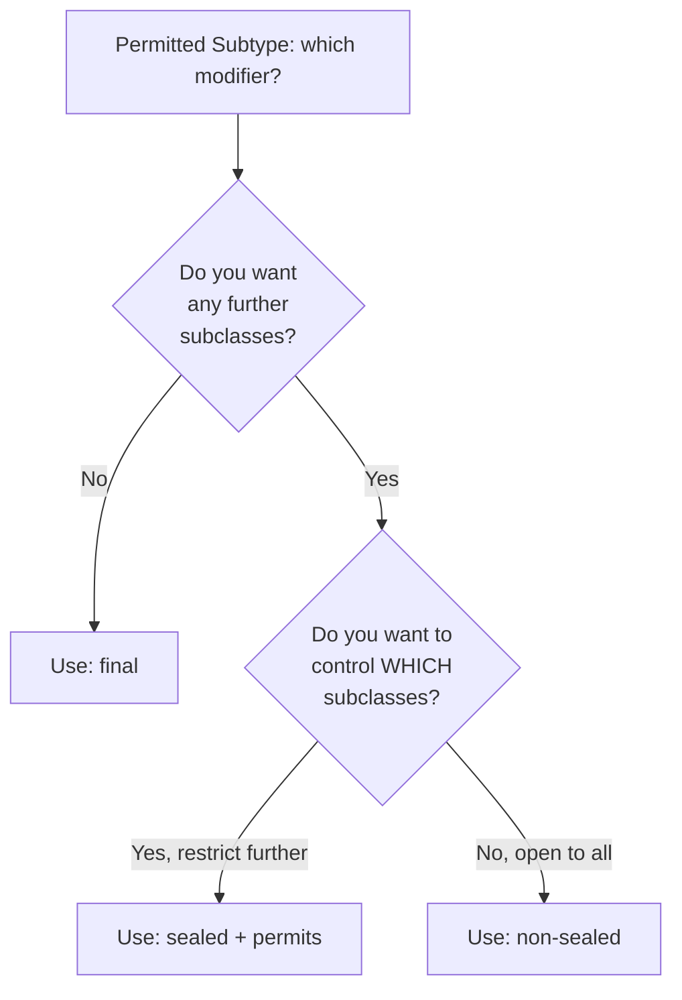
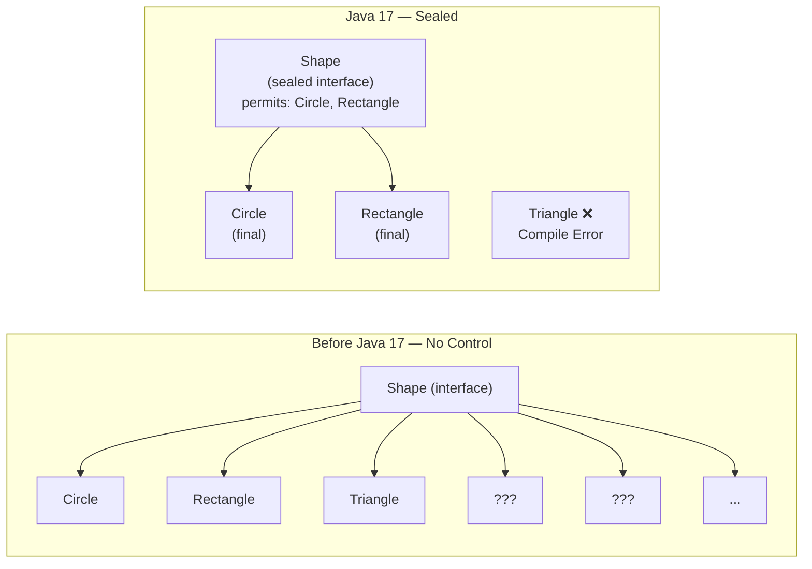
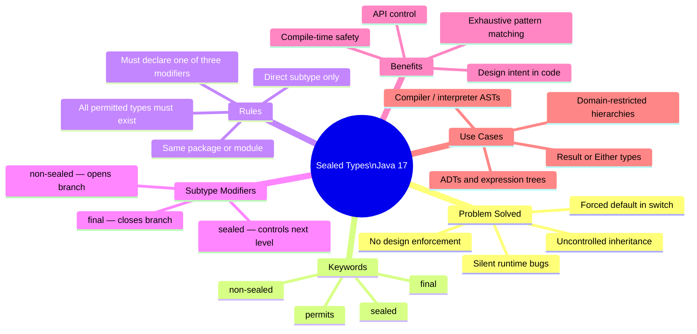
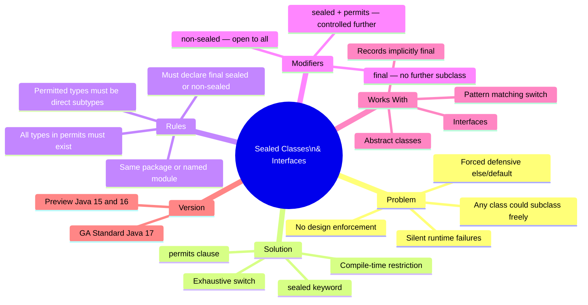

# 📌 Java Sealed Classes and Interfaces (Java 17)

> A comprehensive study guide covering the motivation behind sealed types, syntax, rules, subclass modifiers, hierarchy design, and real-world usage patterns introduced in Java 17.

---

## Table of Contents

1. [The Problem: Lack of Control in Inheritance](#1-the-problem-lack-of-control-in-inheritance)
2. [What Are Sealed Classes and Interfaces?](#2-what-are-sealed-classes-and-interfaces)
3. [Why Sealed Types Were Introduced](#3-why-sealed-types-were-introduced)
4. [Syntax](#4-syntax)
5. [The Three Subclass Modifiers: `final`, `non-sealed`, `sealed`](#5-the-three-subclass-modifiers-final-non-sealed-sealed)
6. [Rules and Constraints](#6-rules-and-constraints)
7. [Complete Hierarchy Example](#7-complete-hierarchy-example)
8. [Code Examples](#8-code-examples)
9. [Sealed Classes vs Sealed Interfaces](#9-sealed-classes-vs-sealed-interfaces)
10. [Sealed Types and Pattern Matching / Switch](#10-sealed-types-and-pattern-matching--switch)
11. [Memory & JVM Behavior](#11-memory--jvm-behavior)
12. [Diagrams](#12-diagrams)
13. [Comparison: Before and After Sealed Types](#13-comparison-before-and-after-sealed-types)
14. [Interview Notes](#14-interview-notes)
15. [Common Mistakes](#15-common-mistakes)
16. [Best Practices](#16-best-practices)
17. [Practice Questions](#17-practice-questions)
18. [Summary](#18-summary)

---

## 1. The Problem: Lack of Control in Inheritance

### Overview

Before Java 17, once you declared an `interface` or a non-`final` class, **anyone** could extend or implement it. There was no language-level mechanism to say "only these specific classes are allowed to participate in this hierarchy."

### The Unrestricted Hierarchy Problem

Consider a simple `Shape` interface:

```java
public interface Shape {
    double area();
}
```

The following classes can all implement `Shape` with zero restriction:

```java
class Circle    implements Shape { ... }
class Rectangle implements Shape { ... }
class Triangle  implements Shape { ... }
class Blob      implements Shape { ... }  // unplanned!
class Amoeba    implements Shape { ... }  // unplanned!
// ... anyone can add more
```

You have **zero control** over who joins this hierarchy — including classes added by other engineers that you never anticipated, from entirely different packages or modules.

### Why This Causes Problems

#### 1. Unpredictable `instanceof` / `if-else` Chains

When consuming a `Shape`, you write defensively:

```java
void draw(Shape shape) {
    if (shape instanceof Circle c) {
        // handle circle
    } else if (shape instanceof Rectangle r) {
        // handle rectangle
    } else {
        // ← forced to write a catch-all for unknown shapes
        throw new UnsupportedOperationException("Unknown shape: " + shape);
    }
}
```

The `else` branch only exists because you cannot guarantee what types will appear. This is **defensive boilerplate driven by uncertainty**, not by design.

#### 2. Incomplete `switch` Statements

```java
switch (shape) {
    case Circle c    -> drawCircle(c);
    case Rectangle r -> drawRectangle(r);
    default          -> { /* forced default */ }
}
```

The compiler requires a `default` because it cannot know all possible subtypes. If a new subtype is added later and you forget to handle it, the `default` branch silently runs — potentially hiding a bug.

#### 3. Silent Runtime Failures

If a new subtype is added and existing `switch` or `if-else` code is not updated, the `default` branch runs silently. The code compiles and runs but produces wrong behavior. This is a **silent bug** — the hardest kind to diagnose.

#### 4. No Design Enforcement

You may have carefully designed a hierarchy where only `Circle`, `Rectangle`, and `Triangle` make semantic sense as shapes in your domain. But the language provides no way to enforce this intent. Any engineer (or library user) can subclass freely.

### The Root Cause

```
Interface / Abstract Class
        ↑         ↑         ↑         ↑
    Circle   Rectangle   Triangle   ???  ← no limit
                ↑
           ???  ← no limit at any level
```

The hierarchy is **open-ended** in every direction with no mechanism to close it.

---

## 2. What Are Sealed Classes and Interfaces?

### Definition

A **sealed class or interface** is one that explicitly restricts which other classes or interfaces may directly extend or implement it. The allowed subtypes are declared using the `permits` clause.

```java
public sealed interface Shape permits Circle, Rectangle, Triangle { }
```

This declaration means:
- `Shape` **can** be subtyped — it is not `final`.
- **Only** `Circle`, `Rectangle`, and `Triangle` may directly implement `Shape`.
- Any other class attempting to implement `Shape` will cause a **compile-time error**.

### Version Introduction

| Feature | JDK Version |
|---|---|
| Sealed classes (Preview) | Java 15 |
| Sealed classes (Second Preview) | Java 16 |
| Sealed classes (Standard/GA) | **Java 17** |

---

## 3. Why Sealed Types Were Introduced

| Goal | How Sealed Types Help |
|---|---|
| **Controlled inheritance** | Only listed classes may extend/implement |
| **Exhaustive type checking** | Compiler knows all subtypes → no forced `default` |
| **Design intent as code** | The `permits` clause documents which types are valid |
| **Better pattern matching** | Works with `switch` expressions for exhaustive, safe dispatch |
| **API stability** | Library authors can expose a type hierarchy without allowing users to extend it arbitrarily |

### Real-World Analogy

Think of a sealed class like a **franchise agreement**. A parent company (the sealed class) defines exactly which franchise owners (permitted subclasses) are allowed to operate. No new franchisee can open a branch without being named in the agreement. The franchise structure is **closed by design, not by accident**.

---

## 4. Syntax

### Sealed Interface

```java
public sealed interface Shape permits Circle, Rectangle, Triangle {
    double area();
}
```

### Sealed Class

```java
public sealed class Vehicle permits Car, Truck, Motorcycle {
    // common fields and methods
}
```

### Sealed Abstract Class

```java
public sealed abstract class AbstractShape permits Rectangle, Triangle {
    public abstract double area();
    public abstract double perimeter();
}
```

### Syntax Breakdown

| Keyword / Element | Role |
|---|---|
| `sealed` | Declares that this type restricts its subtypes |
| `permits` | Introduces the list of allowed direct subtypes |
| `Circle, Rectangle, ...` | Comma-separated list of permitted subtype names |
| Each permitted subtype | Must itself be declared `final`, `sealed`, or `non-sealed` |

> [!IMPORTANT]
> Every class or interface named in the `permits` list **must** be in the same package (or the same named module) as the sealed type, and must directly extend/implement the sealed type.

---

## 5. The Three Subclass Modifiers: `final`, `non-sealed`, `sealed`

Every class named in a `permits` list **must** be declared with exactly one of these three modifiers. This is mandatory — omitting the modifier causes a compile-time error.

### 5.1 `final` — Close the Branch

```java
public final class Circle implements Shape {
    private final double radius;
    // ...
}
```

**Meaning:** No further subclassing allowed. `Circle` is a **leaf** in the hierarchy. This is the end of this branch.

**Use when:** The type is fully concrete and no meaningful specialization of it should ever exist.



### 5.2 `non-sealed` — Open the Branch

```java
public non-sealed interface Polygon extends Shape {
    int sides();
}
```

**Meaning:** This subtype is **open to any further subclass**, without restriction. It abandons the sealed constraint for its own subtree.

**Use when:** You want the sealed type to be controlled, but you intentionally want to allow free extension at this particular branch.



> [!NOTE]
> Once a branch is `non-sealed`, the exhaustiveness guarantee is **lost for that branch**. Pattern matching over `Shape` would still need a `default` or a catch-all for the `Polygon` branch.

### 5.3 `sealed` (with further `permits`) — Control the Next Level

```java
public sealed abstract class AbstractShape implements Shape
        permits Rectangle, Triangle {
    // ...
}
```

**Meaning:** This subtype is itself sealed — it restricts its **own** subclasses to a specific list.

**Use when:** You want to carry the sealed constraint further down the hierarchy, controlling multiple levels.



### Summary Table

| Modifier | Further subclassing | Who can subclass | Exhaustiveness preserved? |
|---|---|---|---|
| `final` | ❌ Not allowed | Nobody | ✅ Yes |
| `non-sealed` | ✅ Unlimited | Anyone | ❌ Lost for this branch |
| `sealed` | ✅ Controlled | Only listed in `permits` | ✅ Yes (for next level too) |

---

## 6. Rules and Constraints

### Rule 1: Permitted Types Must Be Direct Subtypes

Every class in the `permits` list must **directly** extend or implement the sealed type. Indirect inheritance is not allowed.

```java
// ❌ WRONG: Circle does not directly implement Shape
public sealed interface Shape permits Circle { }

class Intermediate implements Shape { }
class Circle extends Intermediate { } // Circle is NOT a direct child of Shape
```

```java
// ✅ CORRECT: Circle directly implements Shape
public sealed interface Shape permits Circle { }

public final class Circle implements Shape { } // direct
```

### Rule 2: Each Permitted Subtype Must Declare `final`, `sealed`, or `non-sealed`

```java
// ❌ WRONG: missing modifier on Circle
public sealed interface Shape permits Circle { }

public class Circle implements Shape { } // compile error: must be final, sealed, or non-sealed
```

```java
// ✅ CORRECT
public sealed interface Shape permits Circle { }

public final class Circle implements Shape { } // ✓
```

### Rule 3: Permitted Types Must Be Present (No Future Classes)

All classes named in the `permits` list must **already exist** as compiled classes. You cannot name a class that does not yet exist.

```java
// ❌ WRONG: if Triangle.java does not exist, this is a compile error
public sealed interface Shape permits Circle, Rectangle, Triangle { }
```

This enforces that the sealed hierarchy is fully defined at compile time — not a placeholder for future work.

### Rule 4: Same Package (or Module)

The sealed type and all its permitted subtypes must be in the **same package** (or, if using the module system, in the same named module).

```java
// package com.example.shapes
public sealed interface Shape permits Circle, Rectangle { }

// ❌ WRONG: Circle is in a different package
// package com.other;
// public final class Circle implements Shape { }
```

### Rule 5: `permits` Clause May Be Omitted If All Subtypes Are in the Same File

If all permitted subclasses are defined in the **same source file** as the sealed type, the `permits` clause can be omitted and the compiler infers it automatically.

```java
// Shape.java — all in one file
public sealed interface Shape { }   // permits inferred from file

final class Circle    implements Shape { }
final class Rectangle implements Shape { }
```

> [!TIP]
> This is useful for small, self-contained hierarchies. For larger hierarchies, always write the `permits` clause explicitly for clarity.

---

## 7. Complete Hierarchy Example

### Design Goal

```
Shape (sealed interface)
├── Circle (final) ← leaf
├── Polygon (non-sealed interface) ← open branch
│   ├── Hexagon
│   ├── Pentagon
│   └── ... (unlimited)
└── AbstractShape (sealed abstract class) ← controlled branch
    ├── Rectangle (final) ← leaf
    └── Triangle (non-sealed) ← open branch
        ├── EquilateralTriangle
        └── ... (unlimited)
```

### Code

```java
// ─────────────────────────────────────────────
// Level 1: Sealed Interface
// ─────────────────────────────────────────────
public sealed interface Shape
        permits Circle, Polygon, AbstractShape {
    double area();
}

// ─────────────────────────────────────────────
// Level 2a: final class — closes this branch
// ─────────────────────────────────────────────
public final class Circle implements Shape {
    private final double radius;

    public Circle(double radius) {
        this.radius = radius;
    }

    @Override
    public double area() {
        return Math.PI * radius * radius;
    }
}

// ─────────────────────────────────────────────
// Level 2b: non-sealed interface — opens this branch
// ─────────────────────────────────────────────
public non-sealed interface Polygon extends Shape {
    int sides();
}

// Any class can freely implement Polygon
public class Hexagon implements Polygon {
    private final double side;

    public Hexagon(double side) { this.side = side; }

    @Override
    public int sides() { return 6; }

    @Override
    public double area() {
        return (3 * Math.sqrt(3) / 2) * side * side;
    }
}

// ─────────────────────────────────────────────
// Level 2c: sealed abstract class — controls this branch further
// ─────────────────────────────────────────────
public sealed abstract class AbstractShape implements Shape
        permits Rectangle, Triangle {
    public abstract double perimeter();
}

// ─────────────────────────────────────────────
// Level 3a: final class — closes rectangle branch
// ─────────────────────────────────────────────
public final class Rectangle extends AbstractShape {
    private final double width;
    private final double height;

    public Rectangle(double width, double height) {
        this.width = width;
        this.height = height;
    }

    @Override
    public double area() { return width * height; }

    @Override
    public double perimeter() { return 2 * (width + height); }
}

// ─────────────────────────────────────────────
// Level 3b: non-sealed class — opens triangle branch
// ─────────────────────────────────────────────
public non-sealed class Triangle extends AbstractShape {
    private final double a, b, c; // side lengths

    public Triangle(double a, double b, double c) {
        this.a = a; this.b = b; this.c = c;
    }

    @Override
    public double area() {
        double s = (a + b + c) / 2;
        return Math.sqrt(s * (s - a) * (s - b) * (s - c));
    }

    @Override
    public double perimeter() { return a + b + c; }
}

// Free subclass of Triangle — allowed because Triangle is non-sealed
public class EquilateralTriangle extends Triangle {
    public EquilateralTriangle(double side) {
        super(side, side, side);
    }
}
```

### Attempting to Add an Unauthorized Subclass

```java
// ❌ COMPILE ERROR: Star is not in Shape's permits list
public final class Star implements Shape {
    public double area() { return 0; }
}
// Error: class is not allowed to implement sealed interface Shape
```

---

## 8. Code Examples

### Example 1 — Basic Sealed Class (Beginner)

```java
public sealed class Notification permits EmailNotification, SMSNotification, PushNotification {
    public abstract void send(String message);
}

public final class EmailNotification extends Notification {
    @Override
    public void send(String message) {
        System.out.println("Email: " + message);
    }
}

public final class SMSNotification extends Notification {
    @Override
    public void send(String message) {
        System.out.println("SMS: " + message);
    }
}

public final class PushNotification extends Notification {
    @Override
    public void send(String message) {
        System.out.println("Push: " + message);
    }
}
```

**Usage:**

```java
Notification n = new EmailNotification();
n.send("Hello!");
// Output: Email: Hello!
```

**What this demonstrates:** A sealed class with three `final` permitted subclasses. The hierarchy is completely closed — nobody can add a fourth notification type without modifying the `permits` clause.

---

### Example 2 — Sealed Interface with Mixed Modifiers (Intermediate)

```java
public sealed interface Result<T> permits Result.Success, Result.Failure {

    record Success<T>(T value) implements Result<T> { }    // final implicitly (records are final)

    record Failure<T>(String error) implements Result<T> { }
}
```

**Usage:**

```java
Result<Integer> result = new Result.Success<>(42);

// Exhaustive switch — no default needed!
String message = switch (result) {
    case Result.Success<Integer> s -> "Got value: " + s.value();
    case Result.Failure<Integer> f -> "Error: " + f.error();
};

System.out.println(message);
// Output: Got value: 42
```

**What this demonstrates:** Sealed types combine powerfully with records (which are implicitly `final`) and exhaustive pattern matching.

---

### Example 3 — Multi-Level Sealed Hierarchy (Advanced)

```java
// Sealed base
public sealed interface Expr permits Num, Add, Mul {
    int evaluate();
}

// Leaf: a literal number
public record Num(int value) implements Expr {
    @Override
    public int evaluate() { return value; }
}

// Leaf: addition of two Expr nodes
public record Add(Expr left, Expr right) implements Expr {
    @Override
    public int evaluate() { return left.evaluate() + right.evaluate(); }
}

// Leaf: multiplication of two Expr nodes
public record Mul(Expr left, Expr right) implements Expr {
    @Override
    public int evaluate() { return left.evaluate() * right.evaluate(); }
}
```

**Usage:**

```java
// Represents: (2 + 3) * 4
Expr expr = new Mul(new Add(new Num(2), new Num(3)), new Num(4));
System.out.println(expr.evaluate()); // Output: 20

// Exhaustive pattern matching — compiler verifies all cases covered
String describe(Expr e) {
    return switch (e) {
        case Num(int v)          -> "Number: " + v;
        case Add(Expr l, Expr r) -> "(" + describe(l) + " + " + describe(r) + ")";
        case Mul(Expr l, Expr r) -> "(" + describe(l) + " * " + describe(r) + ")";
    };
}

System.out.println(describe(expr)); // Output: ((2 + 3) * 4)
```

**What this demonstrates:** An algebraic data type (AST — Abstract Syntax Tree) modelled with sealed interfaces and records. This is a classic use case for sealed types in functional/compiler design.

---

## 9. Sealed Classes vs Sealed Interfaces

| Aspect | Sealed Class | Sealed Interface |
|---|---|---|
| Keyword | `sealed class` | `sealed interface` |
| Permitted subtypes can be | classes or interfaces | classes or interfaces |
| Can have constructors | Yes | No |
| Can have state (fields) | Yes | Only `static final` |
| Permitted subtype extends/implements | `extends` | `implements` or `extends` (if subtype is an interface) |
| Abstract methods | Optional | Implicitly abstract (unless `default`) |

Both are declared with `sealed` and `permits`. The primary difference is the same as between any class and interface — it is not a sealed-specific distinction.

---

## 10. Sealed Types and Pattern Matching / Switch

### The Key Benefit: Exhaustive Switching

Because the compiler knows **exactly** which subtypes exist for a sealed type, it can verify that a `switch` expression or statement covers **all** cases. If all cases are covered, **no `default` is needed**.

```java
// Without sealed — default is REQUIRED
double computeArea(Shape shape) {
    return switch (shape) {
        case Circle c    -> Math.PI * c.radius() * c.radius();
        case Rectangle r -> r.width() * r.height();
        default          -> throw new UnsupportedOperationException(); // forced
    };
}

// With sealed (permits Circle, Rectangle only) — no default needed!
double computeArea(Shape shape) {
    return switch (shape) {
        case Circle c    -> Math.PI * c.radius() * c.radius();
        case Rectangle r -> r.width() * r.height();
        // Compiler confirms: these two cover ALL permitted subtypes ✓
    };
}
```

### The Safety Guarantee

If you add a new type to the `permits` list of a sealed type, **all switch expressions that are not exhaustive will fail to compile**. This forces you to handle the new type explicitly — the silent bug scenario from the old world is eliminated.

```java
// You add: Triangle to Shape's permits list
// Now all switch expressions over Shape must handle Triangle too
// → Compile error at every unupdated switch → you can't forget it
```

> [!IMPORTANT]
> This is the most powerful practical benefit of sealed types: they turn **silent runtime failures** into **compile-time errors**.

---

## 11. Memory & JVM Behavior

### Compile-Time Enforcement

Sealed constraints are enforced by the **Java compiler**, not the JVM at runtime. The compiler checks:
- That the `permits` list is exhaustive and valid.
- That each permitted subtype declares `final`, `sealed`, or `non-sealed`.
- That no unlisted class extends or implements the sealed type.

### Class File Metadata

The `sealed` and `permits` information is stored in the compiled `.class` file using two class file attributes (introduced in Java 17):
- `PermittedSubclasses` attribute — lists the binary names of permitted subtypes.
- `Sealed` flag in the access flags.

This means if you compile a sealed class and then replace its `.class` file with a hand-crafted one that removes the `PermittedSubclasses` attribute, the JVM will not enforce the restriction. **The enforcement is primarily at compile time.**

> [!NOTE]
> The JVM does perform some runtime validation via the class loader, but the primary enforcement gate is the Java compiler. Do not rely on sealed constraints as a security mechanism against bytecode manipulation.

### Class Loading

Each permitted subtype is a separate class and is loaded independently by the class loader — exactly like non-sealed types. `sealed` adds no runtime performance overhead.

---

## 12. Diagrams

### Full Shape Hierarchy



### Decision Tree: Which Modifier to Use on a Permitted Subtype?



### Before vs After Sealed Types



### Mind Map



---

## 13. Comparison: Before and After Sealed Types

### Before — Writing Defensive Code

```java
// OLD WAY: shape is uncontrolled
void processShape(Shape shape) {
    if (shape instanceof Circle c) {
        // ...
    } else if (shape instanceof Rectangle r) {
        // ...
    } else {
        // ← MUST have this. Could silently do nothing, or throw.
        System.out.println("Unknown shape, skipping.");
    }
}
```

Problems:
- `else` branch is required and may silently ignore new types.
- No compile-time guarantee that all types are handled.
- Engineers can forget to update this when a new subtype is added.

### After — Exhaustive and Safe

```java
// NEW WAY: Shape is sealed with permits Circle, Rectangle
void processShape(Shape shape) {
    switch (shape) {
        case Circle c    -> drawCircle(c);
        case Rectangle r -> drawRectangle(r);
        // No default needed — compiler verifies exhaustiveness ✓
    }
}
```

Benefits:
- No `default` required.
- If `Triangle` is added to `permits`, every non-exhaustive `switch` over `Shape` fails to compile — you **cannot** forget to handle it.

---

## 14. Interview Notes

> [!IMPORTANT]
> Commonly discussed in Java 17 / modern Java feature interviews.

### Q1: What problem do sealed classes solve?

They solve the **lack of control in inheritance**. Before sealed types, any class could extend or implement any non-final type. This made it impossible to write exhaustive type checks without `default` branches that could silently swallow bugs.

### Q2: What is the difference between `final` and `sealed`?

| | `final` | `sealed` |
|---|---|---|
| Further subclassing | Completely forbidden | Allowed, but only for listed types |
| Use case | True leaf — no children at all | Controlled branching |

### Q3: What are the three modifiers a permitted subtype must declare?

`final`, `non-sealed`, or `sealed` (with its own `permits` clause). One of the three is mandatory.

### Q4: What happens if you forget to declare one of the three modifiers on a permitted subtype?

Compile-time error: the compiler requires each subtype in the `permits` list to explicitly declare its stance on further subclassing.

### Q5: Can a `non-sealed` class's subclasses implement a sealed interface directly?

No. The `non-sealed` modifier opens that particular branch, but a class extending a `non-sealed` subtype is not a **direct** implementor of the sealed interface — it is two levels deep. Only types directly named in `permits` can be direct subtypes of the sealed type.

### Q6: Is the sealed constraint enforced at runtime or compile time?

Primarily at **compile time** by the Java compiler. The information is stored in the `.class` file's `PermittedSubclasses` attribute, and some runtime checking occurs during class loading, but the main enforcement gate is the compiler.

### Q7: How do sealed types interact with `switch` pattern matching?

The compiler knows the complete set of subtypes for a sealed type. A `switch` expression that covers all permitted subtypes is considered **exhaustive** and requires no `default` arm. Adding a new type to `permits` causes every non-exhaustive `switch` to fail compilation.

### Q8: Can the `permits` clause be omitted?

Yes, if all permitted subtypes are declared in the **same source file** as the sealed type. The compiler infers the permits list from the classes in that file.

### Q9: Can an interface be in a `permits` list?

Yes. A `sealed interface` can permit another `interface` (which must then itself be declared `sealed` or `non-sealed`).

### Q10: What is the typical use case for sealed types in real applications?

- **Result / Either types** (Success or Failure) — common in functional-style Java.
- **Domain models** where only known variants are valid (payment method types, notification channels, etc.).
- **ASTs / expression trees** in interpreters and compilers.
- **State machines** where states are a closed, known set.

---

## 15. Common Mistakes

### Mistake 1: Forgetting the Modifier on a Permitted Subtype

```java
// ❌ WRONG: Circle has no modifier
public sealed interface Shape permits Circle { }

public class Circle implements Shape { } // compile error
```

```java
// ✅ CORRECT
public final class Circle implements Shape { }
```

### Mistake 2: Naming a Non-Direct Subtype in `permits`

```java
// ❌ WRONG: Ellipse is not a direct implementor of Shape
public sealed interface Shape permits Ellipse { }

public abstract class Oval implements Shape { }
public final class Ellipse extends Oval { } // Ellipse is not a direct child of Shape
// compile error: Ellipse is not a direct subtype of Shape
```

```java
// ✅ CORRECT: list the direct subtype
public sealed interface Shape permits Oval { }

public non-sealed abstract class Oval implements Shape { }
public final class Ellipse extends Oval { } // now this is fine
```

### Mistake 3: Naming a Class That Doesn't Exist Yet

```java
// ❌ WRONG: Triangle.java does not exist
public sealed interface Shape permits Circle, Rectangle, Triangle { }
// compile error: cannot find class Triangle
```

All classes in `permits` must have existing implementations.

### Mistake 4: Putting Permitted Subtypes in a Different Package

```java
// package com.example.shapes
public sealed interface Shape permits Circle { }

// package com.other   ← WRONG PACKAGE
public final class Circle implements Shape { } // compile error
```

Sealed type and permitted types must share the same package (or named module).

### Mistake 5: Adding `default` to a Switch That Doesn't Need One

```java
// ⚠️ UNNECESSARY (compiles, but defeats the purpose)
switch (shape) {
    case Circle c    -> ...;
    case Rectangle r -> ...;
    default          -> ...; // redundant — and hides future missing cases
}
```

Without `default`, adding a new type to `permits` causes a compile error here — **that's the safety net**. Adding `default` turns that compile error back into a silent runtime issue.

---

## 16. Best Practices

1. **Use `final` as the default modifier for permitted subtypes** unless you have a specific reason to allow further subclassing. Prefer closed hierarchies.

2. **Combine with `record` types.** Records are implicitly `final` and work perfectly as permitted subtypes for value-based hierarchies:
   ```java
   sealed interface Command permits Command.Start, Command.Stop {
       record Start(String name) implements Command { }
       record Stop()             implements Command { }
   }
   ```

3. **Avoid `non-sealed` unless intentionally designing an open extension point.** Using `non-sealed` partially re-introduces the problem sealed types were designed to solve.

4. **Leverage exhaustive `switch` expressions.** The main payoff of sealed types is eliminating `default`. Write exhaustive switches to get compile-time safety.

5. **Keep the hierarchy shallow.** Deep multi-level sealed hierarchies become hard to reason about. Prefer a flat or two-level design.

6. **Use sealed types for domain-closed concepts** — types where the full set of variants is known and stable. Payment methods, shape kinds, AST nodes, state machine states — these are good candidates. Avoid sealing types where extension by library users is a legitimate use case.

7. **Document the reason for `non-sealed`** with a comment when you use it, since it is an intentional deviation from the controlled hierarchy.

---

## 17. Practice Questions

### Easy

1. What keyword is used to declare a sealed class or interface?
2. What keyword introduces the list of permitted subtypes?
3. Name the three modifiers a permitted subtype must use.
4. Can a class from a different package be in the `permits` list?
5. Write a sealed interface `Animal` that permits only `Dog` and `Cat`.

### Medium

6. What happens at compile time if you try to implement a sealed interface from a class not in its `permits` list?
7. Explain why `non-sealed` partially defeats the purpose of sealing a type. When is it still appropriate?
8. Rewrite the following uncontrolled hierarchy as a properly sealed hierarchy:
   ```java
   interface Payment { }
   class CreditCard implements Payment { }
   class BankTransfer implements Payment { }
   class Crypto implements Payment { }
   ```
9. Given a sealed interface `Shape` that permits `Circle` (final) and `Rectangle` (final), write an exhaustive `switch` expression that returns the area without a `default` arm.
10. Why is omitting `default` from an exhaustive switch over a sealed type safer than including it?

### Hard

11. Design a sealed class hierarchy to represent a simple expression language with: integer literals, addition, subtraction, and multiplication. All leaf nodes should be `final`. Implement an `evaluate()` method in each.
12. A sealed interface `Result<T>` permits `Success<T>` and `Failure`. Implement it using records and demonstrate exhaustive pattern matching in a method that returns a `String` in both cases.
13. Explain with a code example how sealed types + pattern matching eliminates the need for the Visitor design pattern in certain scenarios.
14. A team adds `Triangle` to a sealed `Shape`'s `permits` list. Describe the exact sequence of compile errors that will appear across the codebase and how a developer should resolve them systematically.
15. Compare sealed classes to `enum` types. In what scenarios would you choose one over the other? What can sealed classes express that enums cannot?

---

## 18. Summary



### Key Bullet Points

- **Sealed types** restrict which classes may directly extend or implement them, using `sealed` + `permits`.
- Introduced as a **standard feature in Java 17** (previewed in Java 15 and 16).
- The core problem solved: uncontrolled inheritance where **any class** could join a hierarchy silently.
- Every class in the `permits` list must be declared `final`, `non-sealed`, or `sealed` — one of the three is mandatory.
- `final` — closes the branch. No further subclasses.
- `non-sealed` — opens the branch. Any class may subclass freely from this point.
- `sealed` + further `permits` — controls the next level of the hierarchy.
- Permitted subtypes must be **direct** subtypes (not transitively indirect) of the sealed type.
- All classes listed in `permits` must exist at compile time — no placeholders.
- Sealed types and permitted subtypes must be in the **same package** (or same named module).
- `permits` can be **omitted** when all subtypes are in the same source file.
- The biggest practical benefit: **exhaustive `switch` expressions** — the compiler verifies all cases are covered, eliminating forced `default` branches.
- Adding a new type to `permits` causes every non-exhaustive `switch` to **fail at compile time** — impossible to silently miss a new variant.
- Pairs naturally with **records** (implicitly `final`) and **pattern matching** (Java 16+).

---

*End of Chapter — Java Sealed Classes and Interfaces (Java 17)*
