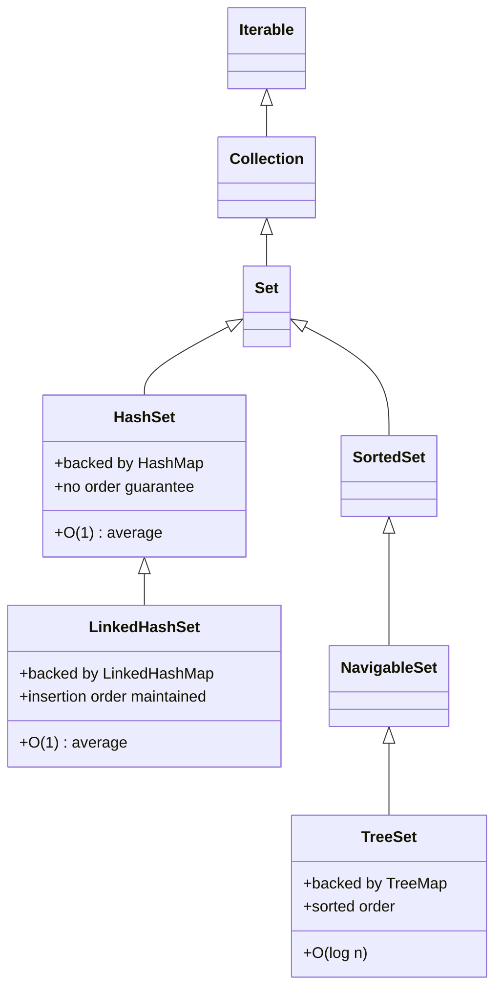
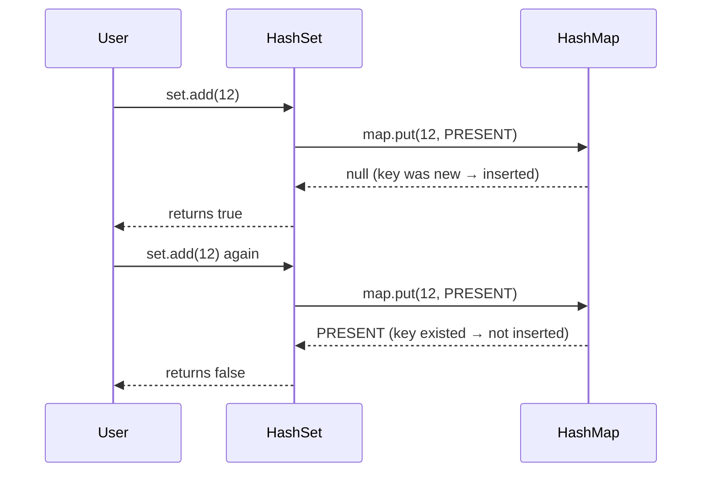
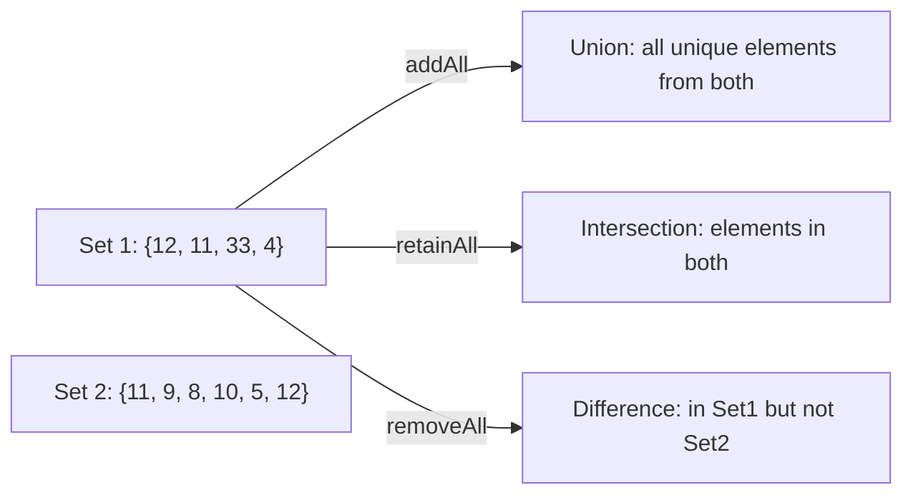

# 📌 Java `Set` Interface — Complete Study Guide

> **Series Context:** This guide is part of a Java Collections series. It assumes familiarity with `HashMap`, `LinkedHashMap`, and `TreeMap`. If you haven't studied those, read those notes first — `Set` implementations are built directly on top of their Map counterparts.

---

## Table of Contents

1. [Overview](#1-overview)
2. [Why Set Exists](#2-why-set-exists)
3. [Set Interface — Core Characteristics](#3-set-interface--core-characteristics)
4. [Set Hierarchy](#4-set-hierarchy)
5. [HashSet — Deep Dive](#5-hashset--deep-dive)
6. [Set Interface Methods](#6-set-interface-methods)
7. [Mathematical Set Operations](#7-mathematical-set-operations)
8. [LinkedHashSet — Deep Dive](#8-linkedhashset--deep-dive)
9. [TreeSet — Deep Dive](#9-treeset--deep-dive)
10. [Thread Safety](#10-thread-safety)
11. [ConcurrentModificationException](#11-concurrentmodificationexception)
12. [Time Complexity Summary](#12-time-complexity-summary)
13. [Comparison Table](#13-comparison-table)
14. [Common Mistakes](#14-common-mistakes)
15. [Best Practices](#15-best-practices)
16. [Interview Notes](#16-interview-notes)
17. [Practice Questions](#17-practice-questions)
18. [Summary](#18-summary)

---

## 1. Overview

The `Set` interface is part of the Java Collections Framework (`java.util` package). It models the mathematical concept of a **set** — an unordered collection with **no duplicate elements**.

`Set` is a child interface of `Collection`, which itself extends `Iterable`. This means `Set` inherits all methods from `Collection` and also adds a few set-specific methods.

```
Iterable
  └── Collection
        └── Set
              ├── HashSet
              ├── LinkedHashSet
              └── SortedSet
                    └── NavigableSet
                          └── TreeSet
```

---

## 2. Why Set Exists

**Problem:** `List` allows duplicate values. In many real-world scenarios you want a collection of **unique items** — unique user IDs, unique product codes, unique tags on a blog post. Maintaining uniqueness in a `List` requires manual `contains()` checks before every insertion, which is O(n) per operation.

**Solution:** `Set` enforces uniqueness automatically and efficiently using hashing (HashSet) or tree-based ordering (TreeSet), giving O(1) or O(log n) uniqueness checks respectively.

**Key use cases:**
- Removing duplicates from a stream of data
- Membership testing ("is this item already registered?")
- Set-algebra operations: union, intersection, difference
- Storing unique identifiers

---

## 3. Set Interface — Core Characteristics

| Property | Details |
|---|---|
| **Duplicate values** | Not allowed |
| **Null values** | At most one `null` (depends on implementation) |
| **Ordering** | Not guaranteed (unless `LinkedHashSet` or `TreeSet`) |
| **Index access** | Not supported |
| **Parent interface** | `Collection` |

> [!IMPORTANT]
> A `Set` **cannot be accessed via index**. There is no `set.get(0)`. You must iterate over it using an enhanced for-loop, iterator, or stream.

---

## 4. Set Hierarchy



---

## 5. HashSet — Deep Dive

### 5.1 Overview

`HashSet` is the most commonly used `Set` implementation. It stores elements using a hash table internally.

### 5.2 Internal Working — How HashSet Uses HashMap Internally

This is the most important concept to understand about `HashSet`.

**Every `HashSet` internally contains a `HashMap`.**

When you do:
```java
Set<Integer> set = new HashSet<>();
set.add(12);
```

Internally, `HashSet` does:
```java
map.put(12, PRESENT);
```

Where `PRESENT` is a private static final dummy `Object`:
```java
private static final Object PRESENT = new Object();
```

So the **element you insert becomes the key**, and the **value is always a meaningless dummy object (`new Object()`)**.

This is exactly why `HashSet` cannot have duplicate values — a `HashMap` cannot have duplicate keys. If you try to `add()` a value that is already in the set, the `put()` call finds the key already exists and simply returns, adding nothing.

**From the actual JDK source of `HashSet.add()`:**
```java
public boolean add(E e) {
    return map.put(e, PRESENT) == null;
}
```

- Returns `true` if the element was added (key was new).
- Returns `false` if the element already existed (key was already present, so `put` returned the old value `PRESENT`, not `null`).



### 5.3 Why HashSet Does Not Guarantee Order

Because it delegates to `HashMap`, and `HashMap` does not guarantee ordering. Elements are stored in buckets based on their `hashCode()`. The iteration order depends on the hash values, not insertion sequence.

### 5.4 Null Handling in HashSet

`HashSet` allows **exactly one `null`** element, because `HashMap` allows one `null` key.

```java
Set<String> set = new HashSet<>();
set.add(null);  // allowed
set.add(null);  // duplicate, silently ignored
System.out.println(set.size()); // 1
```

### 5.5 Basic Code Example

```java
import java.util.HashSet;
import java.util.Set;

public class HashSetDemo {
    public static void main(String[] args) {
        Set<Integer> set = new HashSet<>();

        set.add(12);
        set.add(11);
        set.add(33);
        set.add(4);
        set.add(12); // duplicate — ignored

        System.out.println(set);         // order NOT guaranteed
        System.out.println(set.size());  // 4

        boolean added = set.add(12);
        System.out.println("Was 12 added again? " + added); // false
    }
}
```

**Output (order may vary):**
```
[33, 4, 11, 12]
4
Was 12 added again? false
```

> [!NOTE]
> The printed order `[33, 4, 11, 12]` is **not** the insertion order. It's the bucket order decided by `hashCode()`. Do not rely on this.

---

## 6. Set Interface Methods

`Set` extends `Collection`, so it inherits all `Collection` methods. Below are the key methods:

| Method | Description |
|---|---|
| `add(E e)` | Adds element if not already present. Returns `true` if added, `false` if duplicate. |
| `remove(Object o)` | Removes the specified element. Returns `true` if it was present. |
| `contains(Object o)` | Returns `true` if the set contains the element. |
| `size()` | Returns the number of elements. |
| `isEmpty()` | Returns `true` if the set has no elements. |
| `clear()` | Removes all elements. |
| `iterator()` | Returns an `Iterator` over the elements. |
| `addAll(Collection c)` | Union — adds all elements from another collection (ignores duplicates). |
| `removeAll(Collection c)` | Difference — removes all elements that are also in the given collection. |
| `retainAll(Collection c)` | Intersection — keeps only elements that are also in the given collection. |
| `containsAll(Collection c)` | Returns `true` if this set contains all elements of the given collection (subset check). |
| `toArray()` | Returns an array containing all elements. |

---

## 7. Mathematical Set Operations

`Set` in Java directly mirrors mathematical set theory. Three core set operations are supported:

### 7.1 Union — `addAll()`

Union = all unique elements from **both** sets.

```
Set 1: {12, 11, 33, 4}
Set 2: {11, 9, 8, 10, 5, 12}
Union: {12, 11, 33, 4, 9, 8, 10, 5}
```

```java
Set<Integer> set1 = new HashSet<>(Arrays.asList(12, 11, 33, 4));
Set<Integer> set2 = new HashSet<>(Arrays.asList(11, 9, 8, 10, 5, 12));

Set<Integer> union = new HashSet<>(set1);
union.addAll(set2);

System.out.println("Union: " + union);
// Union: [33, 4, 5, 8, 9, 10, 11, 12]  (order may vary)
```

**How it works internally:** `addAll()` calls `add()` for each element in `set2`. Since `add()` delegates to `map.put()`, duplicate keys are silently ignored.

### 7.2 Intersection — `retainAll()`

Intersection = elements **common** to both sets.

```
Set 1: {12, 11, 33, 4}
Set 2: {11, 9, 8, 10, 5, 12}
Intersection: {11, 12}
```

```java
Set<Integer> set1 = new HashSet<>(Arrays.asList(12, 11, 33, 4));
Set<Integer> set2 = new HashSet<>(Arrays.asList(11, 9, 8, 10, 5, 12));

Set<Integer> intersection = new HashSet<>(set1);
intersection.retainAll(set2);

System.out.println("Intersection: " + intersection);
// Intersection: [11, 12]
```

### 7.3 Difference — `removeAll()`

Difference = elements in Set 1 that are **not** in Set 2.

```
Set 1: {12, 11, 33, 4}
Set 2: {11, 9, 8, 10, 5, 12}
Difference (Set1 - Set2): {33, 4}
```

```java
Set<Integer> set1 = new HashSet<>(Arrays.asList(12, 11, 33, 4));
Set<Integer> set2 = new HashSet<>(Arrays.asList(11, 9, 8, 10, 5, 12));

Set<Integer> difference = new HashSet<>(set1);
difference.removeAll(set2);

System.out.println("Difference: " + difference);
// Difference: [33, 4]
```

### 7.4 Complete Example

```java
import java.util.*;

public class SetOperationsDemo {
    public static void main(String[] args) {
        Set<Integer> set1 = new HashSet<>(Arrays.asList(12, 11, 33, 4));
        Set<Integer> set2 = new HashSet<>(Arrays.asList(11, 9, 8, 10, 5, 12));

        // Union
        Set<Integer> union = new HashSet<>(set1);
        union.addAll(set2);
        System.out.println("Union:        " + union);

        // Intersection
        Set<Integer> intersection = new HashSet<>(set1);
        intersection.retainAll(set2);
        System.out.println("Intersection: " + intersection);

        // Difference (set1 - set2)
        Set<Integer> difference = new HashSet<>(set1);
        difference.removeAll(set2);
        System.out.println("Difference:   " + difference);
    }
}
```

**Output:**
```
Union:        [33, 4, 5, 8, 9, 10, 11, 12]
Intersection: [11, 12]
Difference:   [33, 4]
```



---

## 8. LinkedHashSet — Deep Dive

### 8.1 Overview

`LinkedHashSet` extends `HashSet` but **maintains insertion order**. It is backed by a `LinkedHashMap` internally.

### 8.2 Internal Working

`LinkedHashSet` calls the package-private `HashSet` constructor that accepts a `LinkedHashMap`:
```java
HashSet(int initialCapacity, float loadFactor, boolean dummy) {
    map = new LinkedHashMap<>(initialCapacity, loadFactor);
}
```

`LinkedHashMap` maintains a **doubly linked list** running through all its entries. This linked list records insertion order. When you iterate over a `LinkedHashSet`, you traverse this linked list, so elements come out in insertion order.

### 8.3 Why Access Order Is NOT Supported in LinkedHashSet

`LinkedHashMap` supports two modes:
- **Insertion order** (default, `accessOrder = false`)
- **Access order** (LRU-style, `accessOrder = true`)

When `LinkedHashSet` creates its internal `LinkedHashMap`, it **never passes `accessOrder = true`**. The constructor always uses `false`. Even if you pass `true` internally, `LinkedHashSet` ignores it. So `LinkedHashSet` **only maintains insertion order**, never access order.

### 8.4 Code Example

```java
import java.util.LinkedHashSet;
import java.util.Set;

public class LinkedHashSetDemo {
    public static void main(String[] args) {
        Set<Integer> set = new LinkedHashSet<>();

        set.add(27);
        set.add(7);
        set.add(82);
        set.add(63);
        set.add(5);
        set.add(27); // duplicate — ignored

        System.out.println(set); // insertion order guaranteed
    }
}
```

**Output:**
```
[27, 7, 82, 63, 5]
```

> [!NOTE]
> The output exactly matches the insertion order. This is the key difference from `HashSet`.

### 8.5 Thread Safety

`LinkedHashSet` is **not thread-safe**, because `LinkedHashMap` is not thread-safe.

To make it thread-safe:
```java
Set<Integer> syncSet = Collections.synchronizedSet(new LinkedHashSet<>());
```

---

## 9. TreeSet — Deep Dive

### 9.1 Overview

`TreeSet` implements the `NavigableSet` interface and stores elements in **sorted order** (natural ordering by default, or by a custom `Comparator`). It is backed by a `TreeMap` internally.

### 9.2 Internal Working

From the JDK source:
```java
public TreeSet() {
    this(new TreeMap<>());
}
```

`TreeMap` uses a **Red-Black Tree** (a self-balancing binary search tree). All operations (add, remove, contains) are O(log n) because of the tree traversal.

Elements in `TreeSet` are always stored in sorted order because `TreeMap` stores keys in sorted order.

### 9.3 Natural Ordering (Default)

```java
import java.util.Set;
import java.util.TreeSet;

public class TreeSetAscending {
    public static void main(String[] args) {
        Set<Integer> treeSet = new TreeSet<>();

        treeSet.add(2);
        treeSet.add(5);
        treeSet.add(63);
        treeSet.add(77);
        treeSet.add(82);

        System.out.println(treeSet); // ascending order
    }
}
```

**Output:**
```
[2, 5, 63, 77, 82]
```

Elements are sorted in natural ascending order for `Integer` (`Comparable` natural ordering).

### 9.4 Custom Ordering with Comparator

```java
import java.util.Comparator;
import java.util.Set;
import java.util.TreeSet;

public class TreeSetDescending {
    public static void main(String[] args) {
        // Lambda comparator: b - a gives descending order
        Set<Integer> treeSet = new TreeSet<>((a, b) -> b - a);

        treeSet.add(2);
        treeSet.add(5);
        treeSet.add(63);
        treeSet.add(77);
        treeSet.add(82);

        System.out.println(treeSet); // descending order
    }
}
```

**Output:**
```
[82, 77, 63, 5, 2]
```

### 9.5 Null Handling in TreeSet

`TreeSet` does **not** allow `null` values, because `TreeMap` does not allow `null` keys (it needs to call `compareTo()` or `compare()` on the key, which throws a `NullPointerException`).

```java
TreeSet<String> set = new TreeSet<>();
set.add(null); // throws NullPointerException
```

> [!WARNING]
> Inserting `null` into a `TreeSet` throws a `NullPointerException`. This is different from `HashSet`, which allows one `null`.

### 9.6 Thread Safety

`TreeSet` is **not thread-safe**, because `TreeMap` is not thread-safe.

---

## 10. Thread Safety

### 10.1 Why Set Implementations Are Not Thread-Safe

All three `Set` implementations (`HashSet`, `LinkedHashSet`, `TreeSet`) are **not thread-safe** because their underlying `Map` implementations (`HashMap`, `LinkedHashMap`, `TreeMap`) are not thread-safe. Multiple threads performing concurrent read/write operations can lead to **data corruption** or **inconsistent state**.

### 10.2 Thread-Safe Set Options

**Option 1: `Collections.synchronizedSet()` (wraps any Set)**

```java
Set<Integer> syncSet = Collections.synchronizedSet(new HashSet<>());
// or
Set<Integer> syncLinkedSet = Collections.synchronizedSet(new LinkedHashSet<>());
```

This wraps every method in a synchronized block, so only one thread can access the set at a time. Simple but can be a bottleneck under high concurrency.

**Option 2: `ConcurrentHashMap.newKeySet()` (preferred for high concurrency)**

```java
import java.util.concurrent.ConcurrentHashMap;
import java.util.Set;

Set<Integer> concurrentSet = ConcurrentHashMap.newKeySet();
concurrentSet.add(1);
concurrentSet.add(2);
```

This creates a `Set` backed by a `ConcurrentHashMap`, which supports **segment-level locking** (much better throughput than fully synchronized wrappers). This is the **recommended thread-safe `Set`** in modern Java.

**Option 3: `CopyOnWriteArraySet` (good for read-heavy scenarios)**

```java
import java.util.concurrent.CopyOnWriteArraySet;

Set<Integer> cowSet = new CopyOnWriteArraySet<>();
```

Creates a new copy of the internal array on every write. Extremely fast reads (no locking), but slow writes. Ideal when reads vastly outnumber writes.

| Option | Mechanism | Best for |
|---|---|---|
| `synchronizedSet()` | Synchronized wrapper | Simple low-concurrency code |
| `ConcurrentHashMap.newKeySet()` | Segment locking | High-concurrency writes |
| `CopyOnWriteArraySet` | Copy-on-write | Read-heavy, rare writes |

---

## 11. ConcurrentModificationException

### 11.1 What Is It?

If you **modify a non-thread-safe collection while iterating over it**, Java throws `ConcurrentModificationException`.

```java
Set<Integer> set = new HashSet<>(Arrays.asList(1, 2, 3, 4, 5));

Iterator<Integer> it = set.iterator();
while (it.hasNext()) {
    Integer val = it.next();
    set.add(8); // MODIFYING while iterating → ConcurrentModificationException!
}
```

**Why this happens:** `HashSet`'s iterator uses a `modCount` field. Every structural modification (add/remove) increments `modCount`. The iterator records the `modCount` at creation time (`expectedModCount`). On every `next()` call, it checks `modCount == expectedModCount`. If they differ, it throws `ConcurrentModificationException`.

### 11.2 Safe Way to Remove During Iteration

Use `Iterator.remove()`:
```java
Set<Integer> set = new HashSet<>(Arrays.asList(1, 2, 3, 4, 5));

Iterator<Integer> it = set.iterator();
while (it.hasNext()) {
    Integer val = it.next();
    if (val == 3) {
        it.remove(); // SAFE — uses the iterator's own remove
    }
}
System.out.println(set); // [1, 2, 4, 5]
```

### 11.3 Safe Way to Add/Remove in Multi-threaded Scenarios

Use a thread-safe set:
```java
Set<Integer> concurrentSet = ConcurrentHashMap.newKeySet();
concurrentSet.addAll(Arrays.asList(1, 2, 3, 4, 5));

// Thread 1: iterating
for (Integer val : concurrentSet) {
    System.out.println(val);
}

// Thread 2: adding (concurrent, no exception)
concurrentSet.add(8);
```

---

## 12. Time Complexity Summary

| Operation | HashSet | LinkedHashSet | TreeSet |
|---|---|---|---|
| `add(e)` | O(1) amortized | O(1) amortized | O(log n) |
| `remove(e)` | O(1) amortized | O(1) amortized | O(log n) |
| `contains(e)` | O(1) amortized | O(1) amortized | O(log n) |
| `size()` | O(1) | O(1) | O(1) |
| Iteration | O(n) | O(n) | O(n) |
| `addAll()` (union) | O(n) | O(n) | O(n log n) |
| `retainAll()` | O(n) | O(n) | O(n log n) |
| `removeAll()` | O(n) | O(n) | O(n log n) |

**Why O(1) for HashSet/LinkedHashSet?** Because they use hashing. `hashCode()` maps the element to a bucket in O(1). Assuming a good hash function, collision chains stay short.

**Why O(log n) for TreeSet?** Because it uses a Red-Black Tree. Every insert/lookup traverses a tree of height O(log n).

> [!NOTE]
> "Amortized O(1)" means the average cost over many operations is O(1), even though occasional rehashing takes O(n). Rehashing doubles the bucket array and redistributes all elements — this is rare and amortized across operations.

---

## 13. Comparison Table

| Feature | HashSet | LinkedHashSet | TreeSet |
|---|---|---|---|
| **Backed by** | HashMap | LinkedHashMap | TreeMap |
| **Order** | No order guarantee | Insertion order | Sorted (natural/custom) |
| **Null allowed** | Yes (one null) | Yes (one null) | No |
| **Duplicates** | No | No | No |
| **Thread-safe** | No | No | No |
| **Time complexity** | O(1) amortized | O(1) amortized | O(log n) |
| **Use case** | Fast lookups, no order needed | Order matters | Sorted iteration needed |
| **`Comparable` required** | No | No | Yes (or provide `Comparator`) |

---

## 14. Common Mistakes

### ❌ Mistake 1: Expecting Order from HashSet

```java
Set<Integer> set = new HashSet<>();
set.add(3);
set.add(1);
set.add(2);
System.out.println(set); // might print [1, 2, 3] — looks ordered, but it's NOT guaranteed
```

> [!WARNING]
> `HashSet` output may **appear** ordered for small integer sets because Java's integer hash codes are the integers themselves, and buckets happen to line up. Do NOT rely on this. Use `LinkedHashSet` for insertion order or `TreeSet` for sorted order.

### ❌ Mistake 2: Adding Null to TreeSet

```java
TreeSet<String> set = new TreeSet<>();
set.add(null); // NullPointerException!
```

**Fix:** Use `HashSet` or `LinkedHashSet` if `null` values are possible.

### ❌ Mistake 3: Modifying Set During Iteration

```java
for (Integer val : set) {
    set.remove(val); // ConcurrentModificationException
}
```

**Fix:** Use `Iterator.remove()` or collect elements to remove separately:
```java
Set<Integer> toRemove = new HashSet<>();
for (Integer val : set) {
    if (val % 2 == 0) toRemove.add(val);
}
set.removeAll(toRemove);
```

### ❌ Mistake 4: Accessing Set by Index

```java
set.get(0); // Compilation error — Set has no get(int index) method
```

**Fix:** Iterate or convert to `List`:
```java
List<Integer> list = new ArrayList<>(set);
list.get(0); // now you can index
```

### ❌ Mistake 5: Assuming `add()` Throws Exception for Duplicates

```java
set.add(12);
set.add(12); // NOT an exception — silently returns false
```

**Fix:** Check the return value if you need to know:
```java
boolean wasAdded = set.add(12);
if (!wasAdded) System.out.println("12 was already in the set");
```

---

## 15. Best Practices

1. **Choose the right implementation:**
   - Need fast lookups, don't care about order → `HashSet`
   - Need insertion order preserved → `LinkedHashSet`
   - Need sorted iteration → `TreeSet`
   - Need thread safety → `ConcurrentHashMap.newKeySet()`

2. **Always program to the interface:**
   ```java
   Set<String> set = new HashSet<>();  // good
   HashSet<String> set = new HashSet<>();  // avoid — limits flexibility
   ```

3. **Override `equals()` and `hashCode()` for custom objects:**
   `HashSet`'s uniqueness guarantee depends on `hashCode()` and `equals()`. If your custom class doesn't override them, two logically equal objects may both be added.
   ```java
   class Person {
       String name;
       @Override public boolean equals(Object o) { ... }
       @Override public int hashCode() { ... }
   }
   ```

4. **Use `addAll()`, `retainAll()`, `removeAll()` for set algebra** instead of manual loops.

5. **Prefer `ConcurrentHashMap.newKeySet()` over `Collections.synchronizedSet()`** for concurrent code.

---

## 16. Interview Notes

### Commonly Asked Questions

**Q1: Why doesn't `Set` allow duplicate values?**

Because internally it uses `HashMap`. When you call `set.add(x)`, it calls `map.put(x, PRESENT)`. `HashMap` cannot have duplicate keys. If the key already exists, `put()` simply overwrites the value (which is the dummy `PRESENT` object anyway) and returns — so the element count stays the same.

**Q2: What data structure does `HashSet` use internally?**

`HashMap`. The element you insert becomes the key, and the value is a static dummy `Object` called `PRESENT`.

**Q3: What is the time complexity of `HashSet` operations?**

O(1) amortized for `add`, `remove`, `contains`. Worst case is O(n) if there are many hash collisions (all elements in one bucket), but this is extremely rare with a good hash function.

**Q4: How does `LinkedHashSet` maintain insertion order?**

It is backed by `LinkedHashMap`, which internally maintains a **doubly linked list** through all entries. This linked list records the insertion sequence. Iteration follows the linked list.

**Q5: Why does `TreeSet` use O(log n) time complexity?**

`TreeSet` is backed by `TreeMap`, which uses a **Red-Black Tree** (a self-balancing binary search tree). The height of a Red-Black Tree with n nodes is always O(log n), so all operations that traverse the tree are O(log n).

**Q6: Can `TreeSet` store `null` values?**

No. `TreeMap` needs to compare keys using `compareTo()` or `compare()`. Calling `null.compareTo(anything)` throws a `NullPointerException`.

**Q7: What is `ConcurrentModificationException`? When does it occur?**

It is thrown when a non-thread-safe collection is structurally modified while being iterated (via an iterator). The iterator uses a `modCount` mechanism to detect this. Fix: use `Iterator.remove()` for safe removal during iteration, or use a thread-safe collection.

**Q8: How to get a thread-safe Set in Java?**

Three options:
- `Collections.synchronizedSet(new HashSet<>())`
- `ConcurrentHashMap.newKeySet()` (preferred)
- `CopyOnWriteArraySet`

**Q9: What is the difference between `HashSet`, `LinkedHashSet`, and `TreeSet`?**

See the [comparison table](#13-comparison-table) above.

**Q10: Why does `LinkedHashSet` not support access order like `LinkedHashMap`?**

When `LinkedHashSet` creates its internal `LinkedHashMap`, it never passes `accessOrder = true`. The API doesn't expose this option, so access order tracking is disabled — only insertion order is maintained.

---

## 17. Practice Questions

### Easy

1. Create a `HashSet` of `String` and add: `"apple"`, `"banana"`, `"apple"`, `"cherry"`. Print the set and its size.

2. Verify that `set.add()` returns `false` when adding a duplicate. Write a program to demonstrate this.

3. Convert a `List<Integer>` with duplicates `[1, 2, 2, 3, 3, 3, 4]` into a `Set` to remove duplicates. Print the result.

4. Create a `LinkedHashSet` and demonstrate that insertion order is preserved.

5. Create a `TreeSet<String>` and add names. Print them. What order are they in?

### Medium

6. Given two `Set<Integer>`, write a program to compute:
   - Union
   - Intersection
   - Difference (A - B) and (B - A)

7. Write a program that demonstrates `ConcurrentModificationException` and then fix it using `Iterator.remove()`.

8. Create a `TreeSet` with a custom `Comparator` to sort strings by **length** (ascending). What happens if two strings have the same length? (Hint: TreeSet uses comparator for equality too.)

9. Write a thread-safe `Set` using `ConcurrentHashMap.newKeySet()` and simulate two threads — one adding elements and one iterating — without throwing exceptions.

10. Write a method that accepts a `String` sentence and returns a `Set<Character>` of all **unique characters** (ignoring spaces).

### Hard

11. Implement your own simplified `MyHashSet<T>` using a `HashMap<T, Object>` internally. Implement `add()`, `remove()`, `contains()`, and `size()`.

12. Explain why the following can cause a bug with `HashSet`:
    ```java
    class Box {
        int value;
        Box(int v) { this.value = v; }
    }
    Set<Box> set = new HashSet<>();
    Box b = new Box(5);
    set.add(b);
    b.value = 10;
    System.out.println(set.contains(b)); // what does this print and why?
    ```

13. Design a system where you need to maintain a collection of unique usernames that preserves signup order and is thread-safe. Which `Set` type(s) would you use?

---

## 18. Summary

```mermaid
mindmap
  root((Java Set))
    HashSet
      Backed by HashMap
      No order guarantee
      O(1) average
      One null allowed
      Not thread-safe
    LinkedHashSet
      Backed by LinkedHashMap
      Insertion order maintained
      O(1) average
      One null allowed
      Not thread-safe
    TreeSet
      Backed by TreeMap
      Sorted order
      O(log n)
      No null allowed
      Not thread-safe
    Thread Safety
      synchronizedSet()
      ConcurrentHashMap.newKeySet()
      CopyOnWriteArraySet
    Set Operations
      addAll → Union
      retainAll → Intersection
      removeAll → Difference
```

**Revision Bullets:**

- `Set` = `Collection` with no duplicates and no index access.
- `HashSet` uses `HashMap` internally; element → key, dummy `Object` → value.
- `add()` returns `false` for duplicates (no exception thrown).
- `HashSet` does not guarantee order. `LinkedHashSet` preserves insertion order. `TreeSet` provides sorted order.
- `LinkedHashSet` uses a `LinkedHashMap` with a doubly linked list for ordering.
- `LinkedHashSet` only supports insertion order, not access order.
- `TreeSet` uses `TreeMap` (Red-Black Tree) → O(log n) for all operations.
- `TreeSet` does **not** allow `null` (TreeMap needs to compare keys).
- None of the three are thread-safe. Use `ConcurrentHashMap.newKeySet()` for thread safety.
- `ConcurrentModificationException` is thrown when you structurally modify a collection while iterating it with an iterator.
- Set algebra: `addAll` = union, `retainAll` = intersection, `removeAll` = difference.
- Always override `equals()` and `hashCode()` in custom objects used inside `HashSet` or `LinkedHashSet`.
