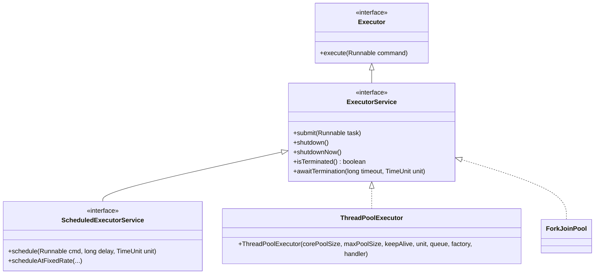
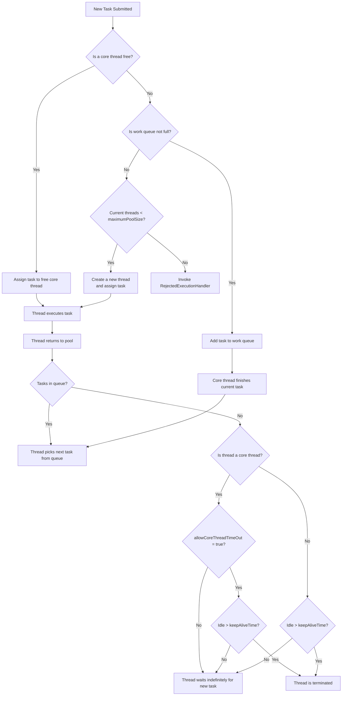
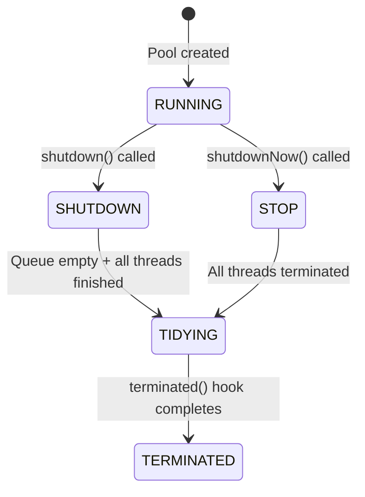
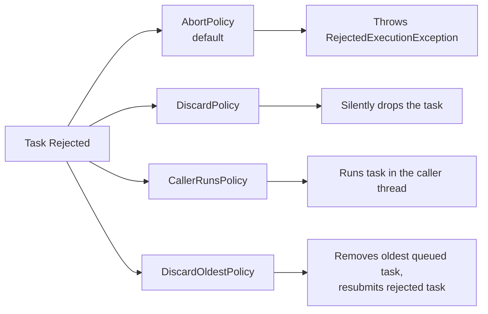
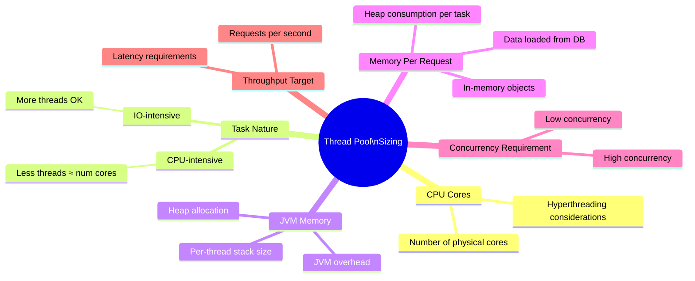

# 📌 Java Thread Pool & ThreadPoolExecutor — Complete Study Guide

> [!IMPORTANT]
> This guide covers **Thread Pool**, **ThreadPoolExecutor**, its constructor parameters, lifecycle, rejection policies, sizing strategies, and interview preparation — from first principles through advanced configuration.

---

## Table of Contents

1. [What is a Thread Pool?](#1-what-is-a-thread-pool)
2. [Why Thread Pools Exist — Advantages](#2-why-thread-pools-exist--advantages)
3. [The Executor Framework](#3-the-executor-framework)
4. [ThreadPoolExecutor — Deep Dive](#4-threadpoolexecutor--deep-dive)
5. [Constructor Parameters Explained](#5-constructor-parameters-explained)
6. [Thread Pool Execution Flow](#6-thread-pool-execution-flow)
7. [ThreadPoolExecutor Lifecycle](#7-threadpoolexecutor-lifecycle)
8. [Rejection Policies](#8-rejection-policies)
9. [ThreadFactory](#9-threadfactory)
10. [Complete Code Example](#10-complete-code-example)
11. [Sizing a Thread Pool — The Interview Question](#11-sizing-a-thread-pool--the-interview-question)
12. [Thread Pool Sizing Formula](#12-thread-pool-sizing-formula)
13. [Memory-Based Sizing](#13-memory-based-sizing)
14. [Common Mistakes](#14-common-mistakes)
15. [Best Practices](#15-best-practices)
16. [Interview Notes](#16-interview-notes)
17. [Practice Questions](#17-practice-questions)
18. [Summary](#18-summary)

---

## 1. What is a Thread Pool?

### Overview

A **Thread Pool** is a managed collection of pre-created threads — often called **worker threads** — that are kept alive and ready to execute submitted tasks. Instead of creating a new thread for every task (and destroying it when the task finishes), the pool **reuses** existing threads, dramatically reducing overhead.

### Real-World Analogy

Think of a restaurant kitchen. Instead of hiring a new chef for each customer order (creating a thread) and firing them when the order is done (destroying the thread), the restaurant keeps a fixed team of chefs (the thread pool). When an order comes in, an available chef takes it. When the order is ready, that chef is immediately ready for the next order. If all chefs are busy, new orders wait in a queue (the work queue).

### Definition

> A **Thread Pool** is a collection of worker threads maintained by an executor framework. Tasks are submitted to the pool, assigned to an available thread, executed, and the thread is then returned to the pool to await new tasks — avoiding the cost of repeated thread creation and destruction.

### How Reuse Works

```
Thread Pool
┌──────────────────────────────┐
│  Thread-0  │  Thread-1  │  Thread-2  │   ← pre-created, waiting
└──────────────────────────────┘
         ↑  Task submitted → assigned to free thread
         ↑  Task completes → thread returns to pool
```

---

## 2. Why Thread Pools Exist — Advantages

### Problem Without Thread Pools

Without a thread pool, the typical pattern is:

```java
// Without thread pool — naïve approach
for (Task task : tasks) {
    new Thread(() -> task.execute()).start(); // new thread every time
}
```

This causes three serious problems:

| Problem | Explanation |
|---|---|
| **Thread creation overhead** | Every `new Thread(...)` allocates stack memory, a program counter, and other per-thread resources. This takes measurable time. |
| **Lifecycle management burden** | Developer must manually track states: new → runnable → running → waiting → terminated. |
| **Uncontrolled context switching** | Creating 100 threads on a 2-core CPU means the OS constantly saves/restores thread state — **context switching** — wasting CPU cycles. |

### Advantage 1 — Thread Creation Time Saved

When a thread is created, the JVM must:
- Allocate a **thread stack** (default 512KB–1MB per thread on most JVMs)
- Initialise a **program counter** (PC register)
- Set up the thread's native OS handle

This allocation takes time. A thread pool pre-allocates these resources once at startup and reuses them indefinitely.

### Advantage 2 — Lifecycle Management Abstracted

The **Executor Framework** fully manages:
- Starting threads
- Putting them into waiting/runnable states
- Assigning tasks
- Terminating threads when the pool shuts down

The developer only submits tasks. The framework handles everything else.

### Advantage 3 — Performance Improvement via Controlled Concurrency

```
2 CPU cores, 100 threads (without pool)
══════════════════════════════════════
CPU:  [Thread-1][Thread-2][CONTEXT SWITCH][Thread-3][Thread-4][CONTEXT SWITCH]...
       ↑ actual work  ↑ idle (saving/restoring state)

2 CPU cores, 2 threads (with pool matching cores)
══════════════════════════════════════
CPU:  [Thread-0][Thread-0][Thread-0][Thread-0]... ← near-zero context switching
       ↑ continuous processing
```

> [!TIP]
> Context switching means the CPU saves the state of the current thread (registers, stack pointer, program counter) and loads another thread's state. During this time, **no useful work is done**. Fewer threads → fewer context switches → more CPU time spent on actual computation.

---

## 3. The Executor Framework

### Package

All executor classes and interfaces live in:

```java
java.util.concurrent
```

### Interface Hierarchy



### Key Interfaces

| Interface | Purpose | Key Methods |
|---|---|---|
| `Executor` | Simplest contract — execute a `Runnable` | `execute(Runnable)` |
| `ExecutorService` | Extends `Executor`; adds lifecycle management | `submit()`, `shutdown()`, `shutdownNow()`, `isTerminated()` |
| `ScheduledExecutorService` | Extends `ExecutorService`; adds delayed/periodic task support | `schedule()`, `scheduleAtFixedRate()` |

### Key Classes

| Class | Purpose |
|---|---|
| `ThreadPoolExecutor` | Fully configurable, general-purpose thread pool |
| `ForkJoinPool` | Work-stealing pool optimised for divide-and-conquer tasks |
| `Executors` | Factory class with convenience methods (`newFixedThreadPool`, `newCachedThreadPool`, etc.) |

> [!NOTE]
> This guide focuses on `ThreadPoolExecutor` — the most important and configurable implementation, and the most common subject of interviews.

---

## 4. ThreadPoolExecutor — Deep Dive

### What It Is

`ThreadPoolExecutor` is the **core, fully-configurable thread pool implementation** in Java. It allows precise control over:
- Minimum and maximum number of threads
- How long idle threads live
- The type and capacity of the work queue
- How new threads are named and configured
- What happens when tasks cannot be accepted

### Why Use It Directly?

The `Executors` factory class (e.g., `Executors.newFixedThreadPool(n)`) creates `ThreadPoolExecutor` instances under the hood, but with less control. Using `ThreadPoolExecutor` directly lets you configure every parameter — which is critical for production systems.

---

## 5. Constructor Parameters Explained

### Full Constructor Signature

```java
public ThreadPoolExecutor(
    int corePoolSize,
    int maximumPoolSize,
    long keepAliveTime,
    TimeUnit unit,
    BlockingQueue<Runnable> workQueue,
    ThreadFactory threadFactory,
    RejectedExecutionHandler handler
)
```

### Parameters At a Glance

| Parameter | Type | Purpose |
|---|---|---|
| `corePoolSize` | `int` | Minimum threads always kept alive in the pool |
| `maximumPoolSize` | `int` | Maximum threads ever allowed in the pool |
| `keepAliveTime` | `long` | Time idle threads (above core) survive before termination |
| `unit` | `TimeUnit` | Unit of `keepAliveTime` (e.g., `SECONDS`, `MINUTES`) |
| `workQueue` | `BlockingQueue<Runnable>` | Queue for tasks waiting to be executed |
| `threadFactory` | `ThreadFactory` | Factory to create new threads (custom naming, priority, daemon flag) |
| `handler` | `RejectedExecutionHandler` | What to do when a task cannot be accepted |

---

### 5.1 `corePoolSize`

**Definition:** The number of threads that are created immediately when the pool is initialised (or on first use) and kept alive **even when idle**.

```java
int corePoolSize = 3;
// → 3 threads are created and permanently present in the pool.
// Even with no tasks, these 3 threads sit and wait.
```

> [!IMPORTANT]
> By default, core threads are **never terminated** even if they have been idle for years. This behaviour can be changed with `allowCoreThreadTimeOut(true)`.

---

### 5.2 `allowCoreThreadTimeOut` (Property, Not Constructor Parameter)

This is a **setter method** called on the `ThreadPoolExecutor` object **after** construction:

```java
executor.allowCoreThreadTimeOut(true);
```

| Value | Behaviour |
|---|---|
| `false` (default) | Core threads live forever, regardless of `keepAliveTime` |
| `true` | Core threads are also subject to `keepAliveTime` termination when idle |

> [!WARNING]
> Even if you set `keepAliveTime = 5` (minutes), core threads will **not** be terminated unless you explicitly call `executor.allowCoreThreadTimeOut(true)`. Many developers forget this and wonder why idle threads are not being cleaned up.

---

### 5.3 `keepAliveTime` and `unit`

**Definition:** The maximum time that **excess idle threads** (threads above `corePoolSize`, or all threads if `allowCoreThreadTimeOut(true)`) will wait for new tasks before being terminated.

```java
long keepAliveTime = 10;
TimeUnit unit = TimeUnit.MINUTES;
// → Any thread idle for more than 10 minutes gets terminated
```

`TimeUnit` options: `NANOSECONDS`, `MICROSECONDS`, `MILLISECONDS`, `SECONDS`, `MINUTES`, `HOURS`, `DAYS`

---

### 5.4 `maximumPoolSize`

**Definition:** The absolute upper limit on the number of threads that can exist in the pool simultaneously.

```java
int corePoolSize    = 3;   // always-present threads
int maximumPoolSize = 5;   // can temporarily grow to 5 under load
```

**When are threads above `corePoolSize` created?**

New threads above `corePoolSize` are created **only when**:
1. All current threads are busy, AND
2. The work queue is full, AND
3. The current thread count is less than `maximumPoolSize`

> [!IMPORTANT]
> New threads are **not** created immediately when `corePoolSize` is exhausted. The pool first tries to queue the task. Only when the queue is also full does the pool attempt to create additional threads (up to `maximumPoolSize`).

---

### 5.5 `workQueue` (BlockingQueue)

**Definition:** A thread-safe queue where tasks wait when all core threads are busy.

#### Two Types of Work Queues

| Type | Class | Behaviour |
|---|---|---|
| **Bounded** | `ArrayBlockingQueue<>(capacity)` | Fixed maximum size. Preferred — gives full control. |
| **Unbounded** | `LinkedBlockingQueue<>()` | No size limit. Tasks accumulate without bound — can cause `OutOfMemoryError`. |

```java
// Bounded — recommended
BlockingQueue<Runnable> queue = new ArrayBlockingQueue<>(100);

// Unbounded — use with caution
BlockingQueue<Runnable> queue = new LinkedBlockingQueue<>();
```

> [!CAUTION]
> Using an unbounded queue (`LinkedBlockingQueue` with no capacity argument) makes `maximumPoolSize` effectively irrelevant — the queue never fills, so extra threads are never created. It can also cause memory exhaustion under heavy load.

---

### 5.6 `threadFactory`

**Definition:** An interface with one method — `newThread(Runnable r)` — that controls how new threads in the pool are created.

**Why customise it?**
- Set meaningful thread names (visible in thread dumps and profilers)
- Set thread priority
- Set daemon vs non-daemon

```java
class MyCustomThreadFactory implements ThreadFactory {
    @Override
    public Thread newThread(Runnable r) {
        Thread thread = new Thread(r);
        thread.setName("my-pool-thread-" + System.currentTimeMillis());
        thread.setPriority(Thread.NORM_PRIORITY);  // 5 — normal priority
        thread.setDaemon(false);                   // non-daemon thread
        return thread;
    }
}
```

> [!TIP]
> Always provide meaningful thread names. When an exception occurs or you analyse a thread dump, names like `"order-processor-1"` are far more useful than the default `"pool-1-thread-1"`.

---

### 5.7 `handler` (RejectedExecutionHandler)

**Definition:** Called when a task **cannot be accepted** by the pool — i.e., all threads are busy, the queue is full, and `maximumPoolSize` is already reached.

Four built-in policies are provided (see [Section 8](#8-rejection-policies)).

---

## 6. Thread Pool Execution Flow

### Complete Decision Flowchart



### Step-by-Step Narrative

**Step 1 — Core threads available:**
When a task arrives, the pool checks if any of the `corePoolSize` threads are free. If yes, the task is immediately assigned to one.

**Step 2 — All core threads busy → try the queue:**
If all core threads are busy, the task is placed in the `workQueue`. This is intentional — the design philosophy is to exhaust the capacity of existing (core) threads before creating new ones. This avoids unnecessary thread proliferation.

**Step 3 — Queue full → create new thread (up to maximum):**
Only when the queue is full does the pool create a new thread (if `maximumPoolSize` allows). This new thread takes the task immediately.

**Step 4 — Maximum reached and queue full → reject:**
If even the `maximumPoolSize` has been reached and the queue is full, the `RejectedExecutionHandler` is invoked.

**Step 5 — Thread completes → returns to pool:**
After completing a task, the thread doesn't die. It checks the queue for waiting tasks. If one exists, it picks it up. If not, it waits for new work.

### Why Queue Before Creating Extra Threads?

> **Design Rationale:** The `corePoolSize` represents the "normal load" capacity — enough threads for typical workloads. The queue buffers burst traffic, giving existing threads a chance to catch up. Creating threads beyond `corePoolSize` is a *last resort* because:
>
> 1. New threads add memory overhead.
> 2. Once created, these threads sit idle in the pool consuming resources even after the burst subsides (until `keepAliveTime` expires).
> 3. The design keeps the pool lean and efficient under normal conditions.

---

## 7. ThreadPoolExecutor Lifecycle

### States



### State Descriptions

| State | Description | Accepts new tasks? | Processes queued tasks? |
|---|---|---|---|
| **RUNNING** | Normal operation | ✅ Yes | ✅ Yes |
| **SHUTDOWN** | `shutdown()` called | ❌ No | ✅ Yes (drains queue) |
| **STOP** | `shutdownNow()` called | ❌ No | ❌ No (attempts to interrupt) |
| **TIDYING** | All tasks done, threads winding down | ❌ No | ❌ No |
| **TERMINATED** | All done | ❌ No | ❌ No |

### Key Methods

```java
executor.shutdown();      // Graceful: finish existing tasks, accept no new ones
executor.shutdownNow();   // Forceful: interrupt running tasks, clear queue
executor.isTerminated();  // Returns true if pool has fully shut down
executor.awaitTermination(60, TimeUnit.SECONDS); // Block until terminated or timeout
```

### `shutdown()` vs `shutdownNow()`

| | `shutdown()` | `shutdownNow()` |
|---|---|---|
| New tasks accepted | No | No |
| Running tasks | Allowed to complete | Interrupted (best-effort) |
| Queued tasks | Will be executed | Returned as a List, not executed |
| Transition | RUNNING → SHUTDOWN → TERMINATED | RUNNING → STOP → TERMINATED |
| Use when | Graceful shutdown required | Immediate abort needed |

---

## 8. Rejection Policies

Triggered when: all threads busy + queue full + at maximum thread count.

### Built-in Policies



### Policy Comparison Table

| Policy Class | Behaviour | Use When |
|---|---|---|
| `AbortPolicy` (default) | Throws `RejectedExecutionException` | You need to know when tasks are dropped |
| `DiscardPolicy` | Silently drops the task | Task loss is acceptable (e.g., non-critical metrics) |
| `CallerRunsPolicy` | Submitting thread executes the task | Natural back-pressure — slows down the producer |
| `DiscardOldestPolicy` | Removes the oldest waiting task, resubmits new task | Newest tasks are more important than older ones |

### Custom Rejection Handler

```java
class CustomRejectionHandler implements RejectedExecutionHandler {
    @Override
    public void rejectedExecution(Runnable r, ThreadPoolExecutor executor) {
        // Log the rejection for monitoring/debugging
        System.err.println("Task rejected: " + r.toString()
            + " | Executor: " + executor.toString());

        // Optional: write to a dead-letter queue, alert, metric increment, etc.
    }
}
```

> [!TIP]
> In production, always use a **custom handler** that logs the rejection with context (task ID, timestamp, queue size). Silent rejection (`DiscardPolicy`) makes debugging extremely difficult.

---

## 9. ThreadFactory

### Interface Definition

```java
public interface ThreadFactory {
    Thread newThread(Runnable r);
}
```

### What You Can Customise

| Property | Method | Purpose |
|---|---|---|
| Thread name | `thread.setName("...")` | Visible in logs, thread dumps, profilers |
| Priority | `thread.setPriority(int)` | `1` (MIN) to `10` (MAX), `5` is NORM |
| Daemon flag | `thread.setDaemon(boolean)` | `true` = JVM can exit even if this thread is running |

### Thread Priority Constants

```java
Thread.MIN_PRIORITY   // 1
Thread.NORM_PRIORITY  // 5  ← default
Thread.MAX_PRIORITY   // 10
```

### Complete Custom ThreadFactory

```java
import java.util.concurrent.ThreadFactory;
import java.util.concurrent.atomic.AtomicInteger;

class MyCustomThreadFactory implements ThreadFactory {
    private final AtomicInteger threadNumber = new AtomicInteger(1);
    private final String namePrefix;

    public MyCustomThreadFactory(String poolName) {
        this.namePrefix = poolName + "-thread-";
    }

    @Override
    public Thread newThread(Runnable r) {
        Thread t = new Thread(r, namePrefix + threadNumber.getAndIncrement());
        t.setPriority(Thread.NORM_PRIORITY);
        t.setDaemon(false);
        return t;
    }
}
```

---

## 10. Complete Code Example

### Scenario

- `corePoolSize = 2`
- `maximumPoolSize = 4`
- `workQueue` capacity = `2`
- Submit 7 tasks (to demonstrate core, queue, max, and rejection)

### Code

```java
import java.util.concurrent.*;

public class ThreadPoolDemo {

    // ── Custom Thread Factory ──────────────────────────────────────────
    static class MyCustomThreadFactory implements ThreadFactory {
        private final AtomicIntegerHolder count = new AtomicIntegerHolder(0);

        @Override
        public Thread newThread(Runnable r) {
            Thread t = new Thread(r);
            t.setName("demo-pool-thread-" + count.incrementAndGet());
            t.setPriority(Thread.NORM_PRIORITY);
            t.setDaemon(false);
            return t;
        }

        // Simple wrapper to avoid importing AtomicInteger for clarity
        static class AtomicIntegerHolder {
            private int val;
            AtomicIntegerHolder(int init) { val = init; }
            int incrementAndGet() { return ++val; }
        }
    }

    // ── Custom Rejection Handler ───────────────────────────────────────
    static class CustomRejectionHandler implements RejectedExecutionHandler {
        @Override
        public void rejectedExecution(Runnable r, ThreadPoolExecutor executor) {
            System.out.println("⚠️  TASK REJECTED: " + r.toString());
        }
    }

    // ── Main ──────────────────────────────────────────────────────────
    public static void main(String[] args) throws InterruptedException {

        int corePoolSize    = 2;
        int maxPoolSize     = 4;
        long keepAliveTime  = 10;
        TimeUnit unit       = TimeUnit.MINUTES;
        BlockingQueue<Runnable> queue = new ArrayBlockingQueue<>(2); // bounded queue, capacity 2

        ThreadPoolExecutor executor = new ThreadPoolExecutor(
            corePoolSize,
            maxPoolSize,
            keepAliveTime,
            unit,
            queue,
            new MyCustomThreadFactory(),
            new CustomRejectionHandler()
        );

        // Optional: allow core threads to also time out when idle
        // executor.allowCoreThreadTimeOut(true);

        int totalTasks = 7;

        for (int i = 1; i <= totalTasks; i++) {
            final int taskId = i;
            executor.submit(() -> {
                System.out.println("✅ Task-" + taskId
                    + " processed by " + Thread.currentThread().getName());
                try {
                    Thread.sleep(5000); // simulate 5-second work
                } catch (InterruptedException e) {
                    Thread.currentThread().interrupt();
                }
            });
        }

        executor.shutdown();
        executor.awaitTermination(60, TimeUnit.SECONDS);
        System.out.println("All tasks complete. Pool terminated.");
    }
}
```

### Dry Run — What Happens With 7 Tasks

| Task # | Thread Pool State | Queue State | Action Taken |
|---|---|---|---|
| Task-1 | 0 busy / 2 core | Empty | Assign to core thread-1 |
| Task-2 | 1 busy / 2 core | Empty | Assign to core thread-2 |
| Task-3 | 2 busy / 2 core | 0/2 | **Queue** Task-3 |
| Task-4 | 2 busy / 2 core | 1/2 | **Queue** Task-4 |
| Task-5 | 2 busy / 2 core | 2/2 (full) | **Create** thread-3, assign Task-5 |
| Task-6 | 3 busy / 4 max  | 2/2 (full) | **Create** thread-4, assign Task-6 |
| Task-7 | 4 busy / 4 max  | 2/2 (full) | **REJECT** → CustomRejectionHandler |

### Expected Output (approximate — thread names and order may vary)

```
✅ Task-1 processed by demo-pool-thread-1
✅ Task-2 processed by demo-pool-thread-2
✅ Task-5 processed by demo-pool-thread-3
✅ Task-6 processed by demo-pool-thread-4
⚠️  TASK REJECTED: java.util.concurrent.FutureTask@...
✅ Task-3 processed by demo-pool-thread-1   ← picked from queue after Task-1 finishes
✅ Task-4 processed by demo-pool-thread-2   ← picked from queue after Task-2 finishes
All tasks complete. Pool terminated.
```

### Line-by-Line Explanation

```java
ThreadPoolExecutor executor = new ThreadPoolExecutor(
    2,                              // corePoolSize: always 2 threads alive
    4,                              // maximumPoolSize: never exceed 4 threads
    10,                             // keepAliveTime: idle extra threads live 10 minutes
    TimeUnit.MINUTES,               // unit: keepAliveTime is in minutes
    new ArrayBlockingQueue<>(2),    // workQueue: bounded, max 2 tasks waiting
    new MyCustomThreadFactory(),    // threadFactory: custom names, priority, daemon
    new CustomRejectionHandler()    // handler: logs rejected tasks
);
```

```java
executor.submit(() -> { ... });
// Submits a Runnable (lambda) as a task.
// The pool assigns it to an available thread or queues it, per the flow above.
```

```java
Thread.sleep(5000);
// Simulates that each task takes 5 seconds.
// This ensures threads stay "busy" long enough for all tasks to arrive,
// demonstrating queueing and max-thread creation.
```

```java
executor.shutdown();
// Stop accepting new tasks. Let existing tasks finish.

executor.awaitTermination(60, TimeUnit.SECONDS);
// Block the main thread for up to 60 seconds, waiting for all tasks to complete.
```

---

## 11. Sizing a Thread Pool — The Interview Question

### The Interview Scenario

> The interviewer asks a candidate to implement a `ThreadPoolExecutor`. The candidate chooses `corePoolSize = 2`. The interviewer follows up:
>
> **"Why 2? Why not 10? Why not 15? What is the reasoning behind your choice?"**

This is a **design question**, not a memorisation question. There is no single correct number — the correct answer demonstrates that you understand the **factors** that govern pool sizing and can reason through them methodically.

### Factors That Determine Thread Pool Size



### Factor 1: CPU Cores

**Why it matters:** A CPU can only run as many threads in true parallel as it has cores. Additional threads are interleaved via context switching.

```
2 CPU Cores:
  Thread-1 and Thread-2 run truly in parallel.
  Thread-3, Thread-4... are context-switched in/out → overhead.

64 CPU Cores:
  Up to 64 threads can run truly in parallel.
  More than 64 → context switching begins.
```

**Rule of thumb:** For pure CPU-bound work, `threadCount ≈ numCpuCores`.

**How to get CPU cores in Java:**

```java
int cores = Runtime.getRuntime().availableProcessors();
System.out.println("Available CPU cores: " + cores);
```

---

### Factor 2: Task Nature — CPU-Intensive vs IO-Intensive

| Task Type | Behaviour | Optimal Thread Count |
|---|---|---|
| **CPU-Intensive** | Thread uses CPU continuously; minimal waiting | ≈ Number of CPU cores |
| **IO-Intensive** | Thread spends most time waiting for IO (DB, network, disk) | Can be significantly > number of cores |

**Why more threads for IO-intensive work?**

When a thread is blocked waiting for a database response, the CPU is idle. The OS can context-switch another thread in. Since the "waiting" thread isn't consuming CPU, the cost of context switching is justified by keeping the CPU busy.

```
IO-Intensive example (DB calls):
Thread-1: [send query]....[waiting for DB response]....[process result]
Thread-2:                  [send query]...[waiting]...[process result]
Thread-3:                               [send query].[waiting].[process]
↑ CPU stays busy because threads are waiting, not competing for CPU time.
```

---

### Factor 3: JVM Memory

Each thread consumes memory:
- **Thread stack:** Configurable via `-Xss` JVM flag. Default varies by OS/JVM (typically 512KB–1MB).
- **Program counter register:** Tiny, but per-thread.
- **Native thread handle:** OS-allocated overhead.

Even if the CPU can handle 1000 threads, the JVM might not have enough memory to allocate stacks for them all.

**Example Calculation:**

```
JVM Total Memory:        2,000 MB (2 GB)
  Heap:                  1,000 MB
  Code Cache:              128 MB
  JVM Internal Overhead:   256 MB
  ────────────────────────────────
  Available for threads:   616 MB  (approx)

Stack size per thread:       5 MB  (1 MB stack + 4 MB other per-thread data)

Max threads from memory:  616 / 5 ≈ 123 threads
```

> [!WARNING]
> These are illustrative estimates. Actual values depend on your JVM configuration, OS, and application. Always profile and test.

---

### Factor 4: Memory Required Per Request

One often-overlooked factor: how much heap memory does each concurrent request consume?

```
Example: Each request loads 10 MB of data into heap (DB results, object graphs, etc.)

If 100 threads handle 100 concurrent requests:
  Memory consumed: 100 × 10 MB = 1,000 MB = 1 GB of heap

If your heap is only 1 GB, you'll get OutOfMemoryError.

Safe concurrent threads: use ~60-70% of heap
  700 MB available for requests / 10 MB per request = 70 threads maximum
```

---

## 12. Thread Pool Sizing Formula

### The Formula

A widely cited formula (from Brian Goetz's *Java Concurrency in Practice*) for estimating **optimal thread count**:

```
Number of Threads = Number of CPU Cores × (1 + Wait Time / Processing Time)
```

Where:
- **Wait Time** = time a thread spends waiting (IO, sleep, blocking)
- **Processing Time** = time a thread actively uses the CPU

### Interpretation

| Scenario | Wait/Processing Ratio | Formula Result | Meaning |
|---|---|---|---|
| Pure CPU-bound | ≈ 0 | `cores × 1 = cores` | Threads = cores |
| Balanced (equal wait & work) | 1 | `cores × 2` | 2× cores |
| Heavy IO (10× wait vs work) | 10 | `cores × 11` | 11× cores |

### Example Calculation

```
Assumptions:
  CPU cores:        64
  Request wait:     50 ms   (IO wait — DB call, network, etc.)
  Processing time: 100 ms   (actual CPU work)

Formula:
  Threads = 64 × (1 + 50/100)
           = 64 × 1.5
           = 96 threads

→ Approximately 96 threads to keep 64 cores maximally utilised.
```

> [!CAUTION]
> This formula does **not** account for memory constraints. It gives you a CPU-utilisation-optimised estimate only. Always cross-check against memory limits (see Section 11 and 13).

---

## 13. Memory-Based Sizing

### Step-by-Step Memory Analysis

#### Step 1: Determine Available JVM Memory for Threads

```
JVM Total Allocation (e.g., -Xmx2g):           2,000 MB
  Minus Heap (-Xmx1g):                        - 1,000 MB
  Minus Code Cache (-XX:ReservedCodeCacheSize): -   128 MB
  Minus JVM Internal Overhead (estimate):       -   256 MB
  ─────────────────────────────────────────────────────────
  Memory available for thread stacks:             616 MB
```

#### Step 2: Determine Per-Thread Memory Cost

```
Per-thread cost:
  Thread stack (default ~512KB, often configured to 1MB): ~1 MB
  PC register + native handle + other:                    ~4 MB
  Total per thread:                                       ~5 MB
```

#### Step 3: Maximum Threads from Memory

```
Max threads = Available Memory / Per-Thread Cost
           = 616 MB / 5 MB
           ≈ 123 threads
```

#### Step 4: Check Heap Headroom Per Request

```
Heap size:                           1,000 MB
Target usage (60% of heap for tasks):  600 MB
Memory consumed per active request:     10 MB

Safe concurrent threads from heap = 600 MB / 10 MB = 60 threads
```

#### Step 5: Reconcile All Constraints

```
Formula-based estimate:        ~96 threads  (CPU utilisation)
Memory-based estimate:         ~123 threads (stack space)
Heap-per-request estimate:     ~60 threads  (heap safety)

→ The most restrictive constraint wins: ~60 threads

Suggested configuration:
  corePoolSize    = 50–60  (handles typical load)
  maximumPoolSize = 60–70  (handles peak with small buffer)
```

#### Step 6: Load Test and Iterate

No formula replaces empirical testing. After setting initial values:
1. Run load tests simulating production traffic.
2. Monitor with profiling tools (JVisualVM, JProfiler, Java Flight Recorder).
3. Watch for: high context switching, GC pressure, thread pool rejection rates, latency percentiles.
4. Adjust `corePoolSize` and `maximumPoolSize` based on observations.
5. Repeat.

### Summary: Interview Answer Framework

When asked "Why did you choose X as your core pool size?", structure your answer:

1. **CPU Cores:** "First I checked how many CPU cores the server has — let's say 64."
2. **Task Nature:** "The tasks are IO-intensive (DB calls), so threads will spend significant time waiting. I used the formula: `threads = cores × (1 + waitTime/processTime)`."
3. **Formula Result:** "That gave me approximately 96 threads."
4. **Memory Check:** "But I also checked available JVM memory. With 2 GB total, after subtracting heap, code cache, and overhead, I estimated ~616 MB for thread stacks. At 5 MB per thread, that's ~123 max threads from memory alone."
5. **Heap Per Request:** "Each request loads ~10 MB into heap. With 1 GB heap and 60% target utilisation, that allows ~60 concurrent requests safely."
6. **Conclusion:** "So I set `corePoolSize = 50` and `maximumPoolSize = 70`, then ran load tests to validate and fine-tune."

---

## 14. Common Mistakes

### Mistake 1: Using Unbounded Queue Without Thinking

```java
// ❌ WRONG — queue can grow without limit, causing OutOfMemoryError
new ThreadPoolExecutor(2, 4, 10, TimeUnit.MINUTES,
    new LinkedBlockingQueue<>());   // no capacity argument!

// ✅ CORRECT — bounded queue with known maximum
new ThreadPoolExecutor(2, 4, 10, TimeUnit.MINUTES,
    new ArrayBlockingQueue<>(100));
```

> [!WARNING]
> `Executors.newFixedThreadPool(n)` and `Executors.newSingleThreadExecutor()` use `LinkedBlockingQueue` with no bound internally. This is a well-known pitfall in production systems.

---

### Mistake 2: Ignoring `allowCoreThreadTimeOut`

```java
// ❌ Misunderstanding: setting keepAliveTime but not enabling it for core threads
executor.setKeepAliveTime(5, TimeUnit.MINUTES);
// Core threads will STILL live forever unless:
executor.allowCoreThreadTimeOut(true); // ← this is REQUIRED
```

---

### Mistake 3: Setting maximumPoolSize Without a Bounded Queue

```java
// ❌ WRONG — with unbounded queue, maximumPoolSize is NEVER triggered
new ThreadPoolExecutor(
    2, 100, 10, TimeUnit.MINUTES,
    new LinkedBlockingQueue<>()  // never fills → maxPoolSize never applies
);
// In practice, this behaves like a fixed pool of 2 threads with unlimited queue.
```

---

### Mistake 4: Not Calling `shutdown()`

```java
// ❌ WRONG — executor and its core threads live forever, preventing JVM exit
ThreadPoolExecutor executor = new ThreadPoolExecutor(...);
// ... submit tasks ...
// ← forgot to call executor.shutdown()
```

Non-daemon threads in the pool prevent the JVM from exiting. Always call `shutdown()` (or `shutdownNow()`) in a `finally` block or use try-with-resources patterns.

---

### Mistake 5: Using Default AbortPolicy Without Try-Catch

```java
// ❌ WRONG — unhandled RejectedExecutionException will crash the submitting thread
executor.submit(task);  // if pool is full, throws RejectedExecutionException

// ✅ CORRECT — catch rejection
try {
    executor.submit(task);
} catch (RejectedExecutionException e) {
    log.error("Task rejected — pool is at capacity", e);
}
```

---

### Mistake 6: Setting `corePoolSize` Arbitrarily

```java
// ❌ WRONG — no reasoning
int corePoolSize = 10; // why 10? no idea

// ✅ CORRECT — derived from CPU cores and task nature
int cores = Runtime.getRuntime().availableProcessors(); // e.g., 8
double waitRatio = 2.0;  // IO-intensive: wait 2× longer than processing
int corePoolSize = (int)(cores * (1 + waitRatio)); // 8 × 3 = 24
```

---

## 15. Best Practices

### 1. Always Use Bounded Queues in Production

```java
new ArrayBlockingQueue<>(500) // choose capacity based on load analysis
```

### 2. Name Your Threads

```java
ThreadFactory factory = r -> {
    Thread t = new Thread(r, "payment-processor-" + counter.incrementAndGet());
    t.setDaemon(false);
    return t;
};
```

### 3. Always Shut Down the Pool

```java
Runtime.getRuntime().addShutdownHook(new Thread(() -> {
    executor.shutdown();
    try {
        if (!executor.awaitTermination(30, TimeUnit.SECONDS)) {
            executor.shutdownNow();
        }
    } catch (InterruptedException e) {
        executor.shutdownNow();
    }
}));
```

### 4. Log Rejections — Never Discard Silently

```java
// Log rejection with full context
class LoggingRejectionHandler implements RejectedExecutionHandler {
    public void rejectedExecution(Runnable r, ThreadPoolExecutor executor) {
        log.error("Task rejected. Pool size: {}, Queue size: {}, Task: {}",
            executor.getPoolSize(),
            executor.getQueue().size(),
            r);
        // Optional: push to retry queue, dead-letter queue, etc.
    }
}
```

### 5. Monitor Your Pool

```java
// Expose these metrics via JMX, Micrometer, or logging
executor.getPoolSize();           // current active threads
executor.getActiveCount();        // threads currently executing tasks
executor.getQueue().size();       // tasks waiting in queue
executor.getCompletedTaskCount(); // total tasks completed since creation
executor.getTaskCount();          // total tasks submitted
```

### 6. Prefer Direct Configuration Over `Executors` Factory Methods

```java
// Avoid — hides important configuration decisions
ExecutorService service = Executors.newFixedThreadPool(10);

// Prefer — explicit, tunable, production-ready
ThreadPoolExecutor executor = new ThreadPoolExecutor(
    10, 20, 60, TimeUnit.SECONDS,
    new ArrayBlockingQueue<>(200),
    new NamedThreadFactory("order-processor"),
    new LoggingRejectionHandler()
);
```

---

## 16. Interview Notes

### Commonly Asked Questions

**Q1: What is a thread pool and why is it used?**
> A thread pool is a collection of pre-created, reusable worker threads. It avoids the overhead of creating and destroying threads for each task, reduces context switching by capping thread count, and abstracts thread lifecycle management.

**Q2: Explain the parameters of `ThreadPoolExecutor`.**
> Walk through: `corePoolSize`, `maximumPoolSize`, `keepAliveTime`, `unit`, `workQueue`, `threadFactory`, `handler`. Explain the execution flow (core → queue → max → reject).

**Q3: What is the difference between `corePoolSize` and `maximumPoolSize`?**
> `corePoolSize` = minimum threads always kept alive. `maximumPoolSize` = absolute upper limit, only reached when the queue is full. The pool never creates beyond-core threads until the queue is exhausted.

**Q4: What happens when both the pool and queue are full?**
> The `RejectedExecutionHandler` is invoked. Default is `AbortPolicy` (throws `RejectedExecutionException`). Other options: `DiscardPolicy`, `CallerRunsPolicy`, `DiscardOldestPolicy`.

**Q5: Why does the executor fill the queue before creating new threads?**
> Design philosophy: `corePoolSize` should handle average load. Queue buffers bursts without creating expensive threads. Extra threads are only created for severe bursts when the queue overflows, avoiding unnecessary thread proliferation under normal conditions.

**Q6: How would you size a thread pool?**
> Consider: (1) CPU cores, (2) task nature (CPU-bound vs IO-bound), (3) available JVM/heap memory, (4) memory consumed per request. Use the formula `threads = cores × (1 + wait/process)`, then validate against memory constraints, then load-test and iterate.

**Q7: What is `CallerRunsPolicy` and when would you use it?**
> The rejected task is executed in the thread that submitted it (e.g., the main/request-handling thread). This creates natural back-pressure — the submitter is slowed down while it executes the task, giving the pool time to catch up. Good for systems where task loss is unacceptable and you want organic throttling.

**Q8: What is `allowCoreThreadTimeOut`?**
> A setter that, when set to `true`, makes core threads (not just extra threads) subject to `keepAliveTime` termination when idle. By default, core threads never terminate.

**Q9: What is the difference between `shutdown()` and `shutdownNow()`?**
> `shutdown()`: graceful — no new tasks, existing tasks finish normally. `shutdownNow()`: forceful — no new tasks, attempts to interrupt running tasks, returns list of unstarted queued tasks.

**Q10: What is context switching and how does a thread pool help?**
> Context switching is when the CPU saves the state of one thread and loads another. It consumes CPU time without doing useful work. Thread pools cap thread count, reducing context switching compared to creating an unbounded number of threads.

### Tricky Points to Remember

- `maximumPoolSize` only activates **after the queue is full**, not when `corePoolSize` is exhausted.
- `Executors.newFixedThreadPool(n)` uses an **unbounded** `LinkedBlockingQueue` — `maximumPoolSize` is effectively irrelevant.
- Setting `keepAliveTime` without `allowCoreThreadTimeOut(true)` has **no effect on core threads**.
- `shutdownNow()` **cannot guarantee** threads are stopped — it sets interrupt flags, but threads must cooperate by checking `Thread.currentThread().isInterrupted()`.

---

## 17. Practice Questions

### Easy

1. What is the purpose of a thread pool?
2. What is `corePoolSize`? How is it different from `maximumPoolSize`?
3. What happens when you submit a task and a core thread is available?
4. Name the four built-in rejection policies in Java.
5. What does `executor.shutdown()` do?

### Medium

6. You have a `ThreadPoolExecutor` with `corePoolSize=2`, `maximumPoolSize=4`, queue capacity=3. You submit 9 tasks simultaneously. Describe exactly what happens to each task.
7. What is `CallerRunsPolicy`? When would you prefer it over `AbortPolicy`?
8. What is the difference between `shutdown()` and `shutdownNow()`?
9. Why does the pool fill the queue before creating threads beyond `corePoolSize`?
10. How would you implement a thread pool that cleans up idle core threads?

### Hard

11. You are designing a thread pool for a microservice that makes DB calls. The server has 16 CPU cores. Each request waits ~200ms for DB and spends ~50ms processing. The JVM has 4 GB, with 2 GB heap, and each request consumes ~20 MB of heap. Derive appropriate `corePoolSize` and `maximumPoolSize`.

12. Explain why `Executors.newFixedThreadPool(100)` can cause `OutOfMemoryError` under heavy load.

13. You observe that your thread pool is rejecting tasks frequently. Walk through a systematic approach to diagnose and fix the issue.

14. Implement a thread pool that retries rejected tasks up to 3 times with exponential back-off.

15. Compare `ForkJoinPool` with `ThreadPoolExecutor`. When would you choose one over the other?

---

## 18. Summary

```
┌─────────────────────────────────────────────────────────────────┐
│                    THREAD POOL — KEY POINTS                      │
├─────────────────────────────────────────────────────────────────┤
│ WHAT      Collection of reusable worker threads                  │
│ WHY       Saves thread creation time, manages lifecycle,         │
│           controls concurrency & context switching               │
│ PACKAGE   java.util.concurrent                                   │
│ KEY CLASS ThreadPoolExecutor                                     │
├─────────────────────────────────────────────────────────────────┤
│ EXECUTION FLOW                                                   │
│  1. Free core thread?  → assign immediately                      │
│  2. Queue not full?    → add to queue                            │
│  3. Under max threads? → create new thread                       │
│  4. Otherwise?         → invoke RejectedExecutionHandler         │
├─────────────────────────────────────────────────────────────────┤
│ KEY PARAMETERS                                                   │
│  corePoolSize       Minimum always-alive threads                 │
│  maximumPoolSize    Absolute upper thread limit                  │
│  keepAliveTime+unit Idle (non-core) thread TTL                   │
│  workQueue          Bounded or unbounded task buffer             │
│  threadFactory      Custom thread name, priority, daemon         │
│  handler            Rejection policy                             │
├─────────────────────────────────────────────────────────────────┤
│ LIFECYCLE: RUNNING → SHUTDOWN → TIDYING → TERMINATED            │
│  shutdown()     Graceful — drain queue, then terminate           │
│  shutdownNow()  Forceful — interrupt threads, clear queue        │
├─────────────────────────────────────────────────────────────────┤
│ REJECTION POLICIES                                               │
│  AbortPolicy        Throw exception (default)                    │
│  DiscardPolicy      Silently drop                                │
│  CallerRunsPolicy   Run in caller's thread (back-pressure)       │
│  DiscardOldestPolicy Remove oldest queued task, retry new one    │
├─────────────────────────────────────────────────────────────────┤
│ SIZING FACTORS                                                   │
│  CPU cores, task nature (CPU vs IO), JVM memory,                │
│  heap per request, concurrency requirements                      │
│  Formula: threads = cores × (1 + waitTime/processTime)          │
│  Always validate with load testing                               │
└─────────────────────────────────────────────────────────────────┘
```

### Quick-Revision Bullets

- A thread pool **reuses** threads — avoids creation/destruction overhead per task.
- `corePoolSize` threads are **always alive**, even idle (unless `allowCoreThreadTimeOut(true)`).
- Task submission order: **core threads → queue → extra threads (up to max) → reject**.
- Extra threads (above core) are **terminated after `keepAliveTime`** when idle.
- Always use a **bounded queue** (`ArrayBlockingQueue`) in production.
- `shutdown()` = graceful; `shutdownNow()` = forceful.
- Thread pool sizing must consider **CPU cores + task nature + JVM memory + heap per request**.
- The formula `threads = cores × (1 + wait/process)` is a **starting point**, not a final answer.
- Load testing and monitoring are **mandatory** for production thread pool tuning.

---

*End of Java Thread Pool Study Guide*
